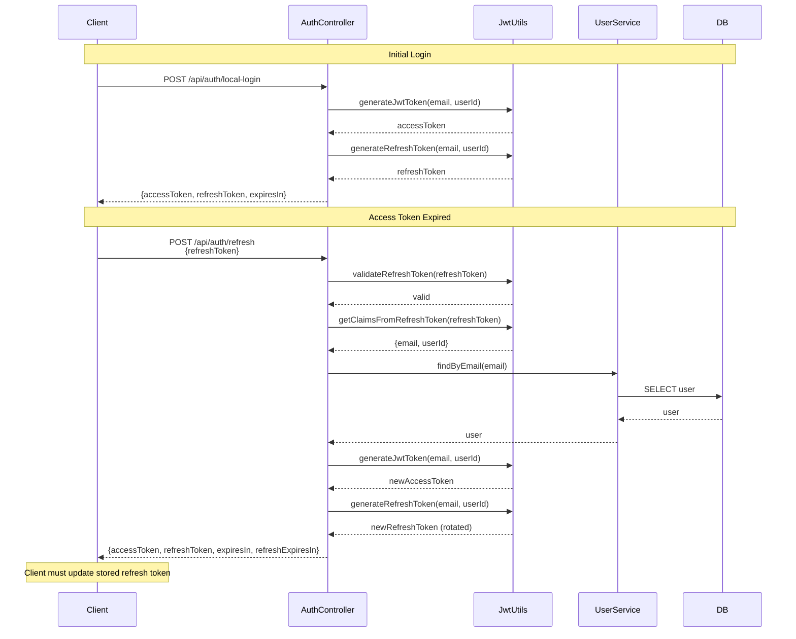

# Refresh Token Endpoint Implementation

## Overview

Currently, dmtools uses stateless JWT tokens for authentication. When tokens expire, clients must re-authenticate. This plan implements a refresh token mechanism that allows clients to obtain new access tokens without re-authentication.

## Architecture

The implementation will use **stateless JWT refresh tokens with rotation** (consistent with current architecture):

- Access tokens: Short-lived (current `jwt.expiration`, default 24 hours)
- Refresh tokens: Long-lived JWT tokens (configurable, default 30 days)
- **Refresh Token Rotation**: Every time a refresh token is used, a new refresh token is generated
  - Active users: Keep getting new refresh tokens, extending their session indefinitely
  - Inactive users: Refresh token expires after configured period, requiring re-authentication
- Both tokens are stateless JWTs (no database storage required)

## Implementation Steps

### 1. Add Refresh Token Configuration

**File**: `dmtools-server/src/main/resources/application.properties`

- Add `jwt.refresh.expiration` property (default: 2592000000 ms = 30 days)
- Update `dmtools-server/PROPERTIES.md` with documentation

### 2. Extend JwtUtils for Refresh Tokens

**File**: `dmtools-server/src/main/java/com/github/istin/dmtools/auth/JwtUtils.java`

- Add `@Value("${jwt.refresh.expiration:2592000000}")` for refresh token expiration (default: 30 days)
- Add method `generateRefreshToken(String email, String userId)` - generates JWT with longer expiration
- Add method `validateRefreshToken(String token)` - validates refresh token (allows expired access tokens but validates refresh token signature)
- Add method `getClaimsFromExpiredToken(String token)` - extracts claims from expired access token for refresh flow
- Update existing methods to handle both access and refresh token types

### 3. Create Refresh Token Request/Response DTOs

**File**: `dmtools-server/src/main/java/com/github/istin/dmtools/auth/dto/RefreshTokenRequest.java`

- Fields: `refreshToken` (String)

**File**: `dmtools-server/src/main/java/com/github/istin/dmtools/auth/dto/RefreshTokenResponse.java`

- Fields: `accessToken` (String), `refreshToken` (String, **required** - new refresh token after rotation), `tokenType` (String, "Bearer"), `expiresIn` (int), `refreshExpiresIn` (int)

### 4. Add Refresh Endpoint to AuthController

**File**: `dmtools-server/src/main/java/com/github/istin/dmtools/auth/AuthController.java`

- Add `POST /api/auth/refresh` endpoint
- Accepts `RefreshTokenRequest` with refresh token
- Validates refresh token (must be valid and not expired)
- Extracts user info from refresh token
- Verifies user still exists in database
- **Always generates new access token AND new refresh token** (mandatory refresh token rotation)
- Returns `RefreshTokenResponse` with both new tokens
- Add Swagger/OpenAPI annotations
- Return 401 if refresh token is invalid or expired

### 5. Update Login Endpoints to Return Refresh Tokens

**File**: `dmtools-server/src/main/java/com/github/istin/dmtools/auth/AuthController.java`

- Update `localLogin()` method to generate and return refresh token
- Update response to include refresh token

**File**: `dmtools-server/src/main/java/com/github/istin/dmtools/auth/dto/LocalLoginResponse.java`

- Add `refreshToken` field (String)

**File**: `dmtools-server/src/main/java/com/github/istin/dmtools/auth/OAuthProxyController.java`

- Update `exchangeCode()` to generate and return refresh token
- Update response to include refresh token

**File**: `dmtools-server/src/main/java/com/github/istin/dmtools/auth/EnhancedOAuth2AuthenticationSuccessHandler.java`

- Consider adding refresh token to cookie (optional, for cookie-based auth)

### 6. Update Security Configuration

**File**: `dmtools-server/src/main/java/com/github/istin/dmtools/auth/SecurityConfig.java`

- Add `/api/auth/refresh` to permitAll() in both standalone and OAuth modes
- Ensure refresh endpoint is accessible without authentication

### 7. Update JWT Authentication Filter

**File**: `dmtools-server/src/main/java/com/github/istin/dmtools/auth/JwtAuthenticationFilter.java`

- Ensure filter doesn't interfere with refresh endpoint (should already work since it's permitAll)
- Consider adding logic to detect refresh token usage and handle appropriately

### 8. Update Client-Side Token Handling (Required for proper UX)

**File**: `dmtools-server/src/main/resources/static/oauth-handler.js`

- Update `storeToken()` to handle refresh token
- Add method `refreshAccessToken()` to call `/api/auth/refresh` endpoint
- Add method to automatically refresh access token when expired (before API calls)
- Update `getStoredToken()` to check refresh token if access token expired
- **Critical**: Update stored refresh token after each successful refresh (token rotation)
- Handle refresh token expiration gracefully (redirect to login)

## Token Flow Diagram



## Security Considerations

1. **Refresh Token Rotation (MANDATORY)**: Always rotate refresh tokens on each use

   - **Active users**: Keep getting new refresh tokens, session extends indefinitely while active
   - **Inactive users**: Refresh token expires after configured period (default 30 days), requiring re-authentication
   - **Security benefit**: If a refresh token is stolen, it can only be used once before being invalidated

2. **Token Revocation**: Since tokens are stateless, revocation requires blacklist (not in scope for initial implementation)
3. **Token Storage**: Client must securely store refresh tokens (localStorage/cookie) and update them on each refresh
4. **HTTPS Only**: Refresh tokens should only be transmitted over HTTPS in production
5. **Client Implementation**: Client must update stored refresh token after each refresh call

## Configuration Properties

Add to `application.properties`:

```properties
# Refresh token expiration (default: 7 days)
jwt.refresh.expiration=604800000
```

## Testing Considerations

1. Test refresh endpoint with valid refresh token
2. Test refresh endpoint with expired refresh token (should return 401)
3. Test refresh endpoint with invalid refresh token (should return 401)
4. Test refresh endpoint with non-existent user (should return 401)
5. Test refresh token rotation (verify new refresh token is different and old one is invalid)
6. Test concurrent refresh requests (should handle gracefully)
7. Test active user scenario (multiple refreshes extend session)
8. Test inactive user scenario (refresh token expires after period)
9. Test client-side token update after refresh

## Files to Modify

1. `dmtools-server/src/main/java/com/github/istin/dmtools/auth/JwtUtils.java` - Add refresh token methods
2. `dmtools-server/src/main/java/com/github/istin/dmtools/auth/AuthController.java` - Add refresh endpoint, update login
3. `dmtools-server/src/main/java/com/github/istin/dmtools/auth/dto/RefreshTokenRequest.java` - New file
4. `dmtools-server/src/main/java/com/github/istin/dmtools/auth/dto/RefreshTokenResponse.java` - New file
5. `dmtools-server/src/main/java/com/github/istin/dmtools/auth/dto/LocalLoginResponse.java` - Add refreshToken field
6. `dmtools-server/src/main/java/com/github/istin/dmtools/auth/OAuthProxyController.java` - Update to return refresh token
7. `dmtools-server/src/main/java/com/github/istin/dmtools/auth/SecurityConfig.java` - Permit refresh endpoint
8. `dmtools-server/src/main/resources/application.properties` - Add refresh token expiration
9. `dmtools-server/PROPERTIES.md` - Document new property
10. `dmtools-server/src/main/resources/static/oauth-handler.js` - Required client-side updates for token rotation