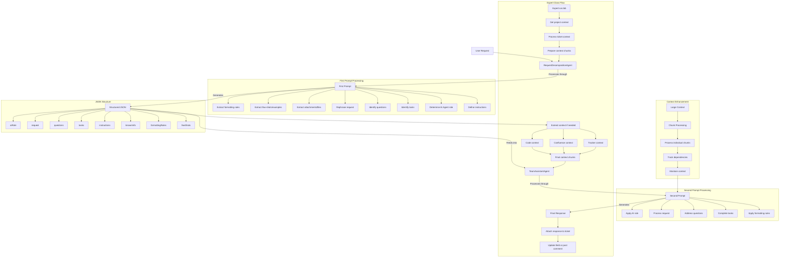

# API Documentation for `DevProductivityReport`

This document provides an example of how to use the `DevProductivityReport` class to configure and execute a developer productivity report. It also includes an example of calling the job using JSON parameters in the `JobRunner`.

---

## Example Usage of `DevProductivityReportParams`

```java
DevProductivityReportParams devProductivityReportParams = new DevProductivityReportParams();

// Set the start date for the report
devProductivityReportParams.set(DevProductivityReportParams.START_DATE, "01.09.2024");

// Set the calculation weight type (e.g., STORY_POINTS or TIME_SPENT)
devProductivityReportParams.set(DevProductivityReportParams.CALC_WEIGHT_TYPE, DevProductivityReportParams.CalcWeightType.STORY_POINTS.name());

// Set the JQL query for filtering tickets
devProductivityReportParams.set(DevProductivityReportParams.INPUT_JQL, JQL);

// Set the name of the report
devProductivityReportParams.set(DevProductivityReportParams.REPORT_NAME, "project_name");

// Enable or disable weighted calculations
devProductivityReportParams.set(DevProductivityReportParams.IS_WEIGHT, true);

// Define the sources for the report (e.g., Bitbucket, GitHub)
devProductivityReportParams.set(DevProductivityReportParams.SOURCES, new JSONArray()
        .put("bitbucket")
        .put("github")
);

// Define the statuses considered "ready for testing"
devProductivityReportParams.set(DevProductivityReportParams.STATUSES_READY_FOR_TESTING, new JSONArray()
        .put("ready for testing")
        .put("release")
        .put("review")
        .put("testing")
        .put("accepted")
        .put("completed")
);

// Set the regex pattern for identifying responsible users in comments
devProductivityReportParams.setCommentsRegexResponsible("Merge request by \\*([\\w\\s-]+)\\*");

// Set the initial status of tickets
devProductivityReportParams.set(DevProductivityReportParams.INITIAL_STATUS, "backlog");

// Define prefixes of tickets to ignore
devProductivityReportParams.set(DevProductivityReportParams.IGNORE_TICKET_PREFIXES, new JSONArray()
        .put("[VD]")
        .put("[QA]")
        .put("[PO]")
        .put("[BA]")
        .put("[SA]")
);

// Define statuses considered "in testing"
devProductivityReportParams.set(DevProductivityReportParams.STATUSES_IN_TESTING, new JSONArray()
        .put("testing")
);

// Define statuses considered "in development"
devProductivityReportParams.set(DevProductivityReportParams.STATUSES_IN_DEVELOPMENT, new JSONArray()
        .put("in progress")
        .put("ready for review")
);

// Set the formula file for calculating productivity
devProductivityReportParams.set(DevProductivityReportParams.FORMULA, "/formula/project_dev_productivity.js");

// Set the employee configuration file
devProductivityReportParams.set(QAProductivityReportParams.EMPLOYEES, "employees.json");


new DevProductivityReport().runJob(devProductivityReportParams);
```

---

## Example JSON Configuration for `JobRunner`

The following JSON configuration can be used to execute the `DevProductivityReport` job via the `JobRunner`.

### JSON Example

```json
{
  "name": "DevProductivityReport",
  "params": {
    "start_date": "01.09.2024",
    "calc_weight_type": "STORY_POINTS",
    "input_jql": "project = PROJECT_NAME AND status != Closed",
    "report_name": "project_name",
    "is_weight": true,
    "sources": ["bitbucket", "github"],
    "statuses_ready_for_testing": ["ready for testing", "release", "review", "testing", "accepted", "completed"],
    "comment_regex_responsible": "Merge request by \\*([\\w\\s-]+)\\*",
    "initial_status": "backlog",
    "ignore_ticket_prefixes": ["[VD]", "[QA]", "[PO]", "[BA]", "[SA]"],
    "statuses_in_testing": ["testing"],
    "statuses_in_development": ["in progress", "ready for review"],
    "formula": "/formula/project_dev_productivity.js",
    "employees": "employees.json"
  }
}
```

---

## Example Employee Configuration File (`employees.json`)

This file defines the employees involved in the project, their roles, and their levels.

```json
[
  {
    "Employee": "John Doe",
    "Role": "Developer",
    "Level": "A3"
  },
  {
    "Employee": "Jane Smith",
    "Role": "Tester",
    "Level": "B2"
  },
  {
    "Employee": "Alice Johnson",
    "Role": "Business Analyst",
    "Level": "A4"
  }
]
```

---

## Example Employee Aliases File (`employees_aliases.json`)

This file maps employee names to their aliases used in various systems.

```json
{
  "John Doe": ["john-doe", "jdoe", "john.doe"],
  "Jane Smith": ["jane-smith", "jsmith", "jane.smith"],
  "Alice Johnson": ["alice-johnson", "ajohnson", "alice.j"]
}
```

---

## Example Formula File (`project_dev_productivity.js`)

This file contains the formula for calculating developer productivity.

```javascript
var storiesPointsFTR = ${.vars["Stories Moved To Testing FTR"]} * 1;
var bugsPointsFTR = ${.vars["Bugs Moved To Testing FTR"]} * 0.5;

// Calculate points for stories moved to testing
var storiesPoints = ${.vars["Stories Moved To Testing"]} * 1;
storiesPoints = storiesPoints - (storiesPoints - storiesPointsFTR) * 0.5;

// Calculate points for bugs moved to testing
var bugsPoints = ${.vars["Bugs Moved To Testing"]} * 0.5;
bugsPoints = bugsPoints - (bugsPoints - bugsPointsFTR) * 0.25;

// Calculate points for bugfixing time
var bugfixTimePoints = ${.vars["Bugfixing Time In Days"]} * 0.1;

// Calculate points for story development time
var storyDevTimePoints = ${.vars["Story Development Time In Days"]} * 0.2;

// Calculate points for vacation days
var vacationDaysPoints = ${.vars["Vacation days"]} * 1;

// Calculate points for pull requests
var pullRequestsPoints = ${.vars["Pull Requests"]?default(0)} * 0.2;
var pullRequestsLinesChanges = ${.vars["Lines Changes in Pull Requests"]?default(0)} * 0.2;

// Calculate points for pull requests comments
var pullRequestsCommentsPointsPositive = ${.vars["Pull Requests Comments Written"]?default(0)} * 0.1;
var pullRequestsCommentsPointsNegative = ${.vars["Pull Requests Comments Gotten"]?default(0)} * 0.15;

// Calculate points for pull requests approvals
var pullRequestsApprovalsPoints = ${.vars["Pull Requests Approvals"]?default(0)} * 0.3;

// Sum up all the calculated points
var totalPoints = storiesPoints + bugsPoints + bugfixTimePoints + storyDevTimePoints
    + vacationDaysPoints + pullRequestsPoints + pullRequestsCommentsPointsPositive - pullRequestsCommentsPointsNegative + pullRequestsApprovalsPoints + pullRequestsLinesChanges;

totalPoints;
```

---

## Running the Job with `JobRunner`

To execute the job, encode the JSON configuration into Base64 and pass it as an argument to the `JobRunner`.

### Example Command

```bash
java -cp your-jar-file.jar com.github.istin.dmtools.job.JobRunner $(echo -n '{"name":"DevProductivityReport","params":{...}}' | base64)
```

Replace `{...}` with the JSON configuration for the job.

---

# API Documentation for `Expert`

This document provides examples of how to use the `Expert` class to configure and execute AI-assisted analysis of tickets. It includes examples of both direct Java usage and JSON configuration for the `JobRunner`.

[Expert Agent Scheme](https://mermaid.live/edit#pako:eNp9ltty4jgQhl9FpWuSGZ8gcLFVDIcsmZw2ZG5G5EJjt0EDlrySPCGb5N23bSvggBOqqMLqT1YffnXzTGOVAB3QdKMe4xXXltyPF5LgZ8h-GNDkDv4twNgHcnLyF_nG3OMYYpXlyggrlBwuQdqHete3knu51SoGY8AQu9KqWK5eyIhNhTaWoCnL3-hRRZ-DBM0tmBcyZnOri9gWGhJyMb-5duC4AqcAiSFCWvVCJuweeDY0RhjLpW36MPnIhymbo98yee_E9NCJc3RV8g2GbnIlDSBXk6b4tdQ8X5EFbQZD3FFCLhe0JnfBkZHHJlureWxJqnTGrUWM6GID5uGI9fcsPJ6YlbLmC2x5lrfSwY7Gt_J4lWEKzJdUtMIhli5faW6AaFfSIyZiswTfIdInUhFY25Y3dfeU5WbdQvTYGCzoTEggwxmpakO02sAxeoZoWnJCmqryjTNBJi2ZL1VBdippJrwSCRl7jIu794c5i8-OQ3emgLVF7IwhOwzUGSLW4nbD3mVrqR7lTKbq2Nhje0HcHejBIWcMdTAvZfBpSt6p-gM1VionU48N83zzVJbloCAO8Jnb3yIThwRsmCS6RNpy5qCQjVSpWwtHKnFE5Fz54Fq0hzpS0sLWkolccRlDKflmlH-zS66XQBxWd60ZG60KuW4kpuHMrEa8XdhCJuKPSApsAHG5ren5zKtpn93jvVuTBHJ0E2Qs3lVv5tdYwK44div8ktg51ICCOg2fRTvZ5oAtebTh6NgUW3Qz1gtWm091IS_UrzrW7-wcLMm1-g3YF45P_V5Rl7torYjX0AZeVuAVgpBzDW_EcU6u6slwqN3rsjlhVLuNIiUS-zckjb3XNeqhVhJoccLZfbTLdFNgoj-hgrooOLNakLpwN66zfxjMdV25m8ZKcLhyUy1M9gvn1cItG1ZdGO9NPTaIVS69jQNuK_Yf9iNPcNiQVMAmIUoTnKVlFbJsP8YwebRDM-yjXCQ4op_L5QW1K1T9gg7wZ8L1ulTEK3K8sGr-JGM6wH4EHVqNPDpI-cbgU1EdNxYclZW9ITmXP5VqPtLBM93SwYnnh_3T3tco8sKzvhd87YYd-lSt90673fAsiBDo9fr98LVD_6ve4Z8Gfq8feH4URlHU9f0OhURYpa_qPxjV_4wOXeoyFudieXf0SBXS0oHXC4PX_wG8FJQg)



---

## Example Usage of `ExpertParams`

```java
ExpertParams expertParams = new ExpertParams();

// Set the project context (can be direct text or Confluence URL)
expertParams.setProjectContext("https://confluence.company.com/display/PROJECT/Context");

// Set the AI request/question
expertParams.setRequest("What are the technical implications of implementing feature X?");

// Set output type (comment or field)
expertParams.setOutputType(ExpertParams.OutputType.field);

// Set the field name if using field output type
expertParams.setFieldName("Technical Analysis");

// Set the JQL query for filtering tickets
expertParams.setInputJql("project = PROJECT_NAME AND status = Open");

// Set the initiator (user who requested the analysis)
expertParams.setInitiator("john.doe");

// Configure source code analysis
expertParams.setCodeAsSource(true);
expertParams.setSourceCodeConfigs(
    new SourceCodeConfig("main-repo", "git@github.com:company/repo.git", "master")
);

// Configure Confluence integration
expertParams.setConfluenceAsSource(true);
expertParams.setConfluencePages(
    "https://confluence.company.com/display/PROJECT/Architecture",
    "https://confluence.company.com/display/PROJECT/Technical+Design"
);

// Set search limits
expertParams.setFilesLimit(10);
expertParams.setConfluenceLimit(10);
expertParams.setTrackerLimit(10);

// Set search iterations
expertParams.setFilesIterations(1);
expertParams.setConfluenceIterations(1);
expertParams.setTrackerIterations(1);

// Set processing timeout
expertParams.setChunkProcessingTimeoutInMinutes(30);

// Set ticket context depth
expertParams.setTicketContextDepth(1);

// Set keywords blacklist
expertParams.setKeywordsBlacklist("https://confluence.company.com/display/PROJECT/Blacklist");

new Expert().runJob(expertParams);
```

---

## Example JSON Configuration for `JobRunner`

```json
{
  "name": "Expert",
  "params": {
    "projectContext": "https://confluence.company.com/display/PROJECT/Context",
    "request": "What are the technical implications of implementing feature X?",
    "outputType": "field",
    "fieldName": "Technical Analysis",
    "inputJql": "project = PROJECT_NAME AND status = Open",
    "initiator": "john.doe",
    "isCodeAsSource": true,
    "isConfluenceAsSource": true,
    "isTrackerAsSource": true,
    "confluencePages": [
      "https://confluence.company.com/display/PROJECT/Architecture",
      "https://confluence.company.com/display/PROJECT/Technical+Design"
    ],
    "ticketContextDepth": 1,
    "filesLimit": 10,
    "confluenceLimit": 10,
    "trackerLimit": 10,
    "chunksProcessingTimeout": 30,
    "filesIterations": 1,
    "confluenceIterations": 1,
    "trackerIterations": 1,
    "keywordsBlacklist": "https://confluence.company.com/display/PROJECT/Blacklist",
    "sourceCodeConfig": [
      {
        "name": "main-repo",
        "url": "git@github.com:company/repo.git",
        "branch": "master"
      }
    ],
    "model": "gpt-4",
    "metadata": {
      "temperature": 0.7,
      "maxTokens": 4000
    }
  }
}
```

---

## Running the Job with `JobRunner`

To execute the job, encode the JSON configuration into Base64 and pass it as an argument to the `JobRunner`.

### Example Command

```bash
java -cp your-jar-file.jar com.github.istin.dmtools.job.JobRunner $(echo -n '{"name":"Expert","params":{...}}' | base64)
```

Replace `{...}` with the JSON configuration for the job.

---

## Output

The Expert job will:

1. Process the specified ticket(s) based on the JQL query
2. Analyze context from multiple sources (code, Confluence, tracker)
3. Generate AI-powered responses
4. Either:
    - Post the response as a comment on the ticket
    - Update a specified field with the response
5. Attach analysis artifacts:
    - `*_stats.json`: Search statistics
    - `*_result.txt`: Detailed analysis results
    - `*_final_answer.txt`: Final AI response

---
