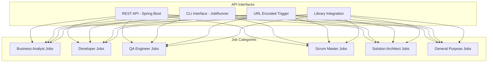

# DMTools - API Reference

## Overview

DMTools provides multiple API interfaces for executing jobs and automating development lifecycle tasks. For detailed API documentation with schemas, interactive testing, and complete parameter descriptions, use the Swagger UI.

## Quick Access

**For complete API documentation, schemas, and interactive testing:**

👉 **Visit Swagger UI: `http://localhost:8080/swagger-ui.html`**

## API Interfaces



## Job Categories

### 📊 Business Analyst Jobs
- **RequirementsCollector** - Collect and analyze requirements from various sources
- **UserStoryGenerator** - Generate user stories from requirements and specifications
- **BusinessAnalyticDORGeneration** - Create Definition of Ready (DOR) for business requirements
- **BAProductivityReport** - Generate Business Analyst productivity reports

### 💻 Developer Jobs
- **DevProductivityReport** - Comprehensive developer productivity analysis
- **CodeGenerator** - AI-powered code generation from specifications
- **UnitTestsGenerator** - Generate unit tests for existing code
- **CommitsTriage** - Analyze and categorize commits for better tracking

### 🧪 QA Engineer Jobs
- **QAProductivityReport** - QA team productivity analysis and metrics
- **TestCaseGenerator** - Automated test case generation from requirements
- **AutomationTestingGenerator** - Generate automation test scripts
- **TestCaseVisualizer** - Create visual representations of test coverage

### 🏃 Scrum Master Jobs
- **DailyReportBot** - Automated daily standup report generation
- **SprintAnalytics** - Sprint performance analysis and metrics
- **TeamProductivityDashboard** - Team-wide productivity visualization

### 🏗️ Solution Architect Jobs
- **ArchitectureDocGenerator** - Generate technical architecture documentation
- **TechnicalSpecGenerator** - Create technical specifications from requirements
- **SystemDesignAnalyzer** - Analyze and document system design decisions

### 🔧 General Purpose Jobs
- **Expert** - AI-powered technical analysis and consultation
- **PresentationMaker** - Automated presentation generation
- **ReportGenerator** - Custom report generation from various data sources

## API Usage Patterns

### 1. REST API
Execute jobs through HTTP endpoints:
```
POST /api/executeJob
Content-Type: application/json

{
  "name": "JobName",
  "params": { ... }
}
```

### 2. Command Line Interface
```bash
java -cp dmtools.jar com.github.istin.dmtools.job.UrlEncodedJobTrigger "$BASE64_ENCODED_PARAMS"
```

### 3. Library Integration
```java
JobParams params = new JobParams();
params.set("parameter", "value");
new JobClass().runJob(params);
```

## Parameter Configuration

### Common Parameters
- `input_jql` - JIRA JQL query for data filtering
- `start_date` / `end_date` - Date range for reports
- `report_name` - Name of the generated report
- `ai_model` - AI model to use (gpt-4, gemini, etc.)
- `output_format` - Output format (confluence, jira, file)

### Configuration Files
- `employees.json` - Employee information and roles
- `employees_aliases.json` - Employee alias mappings
- Formula files (`.js`) - Custom calculation formulas

## Getting Started

1. **Start the server**:
   ```bash
   ./gradlew bootRun
   ```

2. **Access interactive documentation**:
   Visit `http://localhost:8080/swagger-ui.html`

3. **Test job execution**:
   Use the Swagger interface to explore available jobs and their parameters

4. **View job schemas**:
   All job parameters, validation rules, and response formats are documented in Swagger

## Authentication & Security

Authentication is handled through OAuth2 integration. Configuration details are available in the main README.md file.

## Error Handling

All API endpoints return standard HTTP status codes with descriptive error messages. Detailed error schemas and troubleshooting information is available in the Swagger documentation.

## Support

For detailed API usage, complete parameter schemas, and interactive testing:
- **Swagger UI**: `http://localhost:8080/swagger-ui.html` - Complete API documentation
- **GitHub Issues**: [DMTools Issues](https://github.com/IstiN/dmtools/issues)
- **Main Documentation**: [README.md](../README.md) - Setup and configuration 