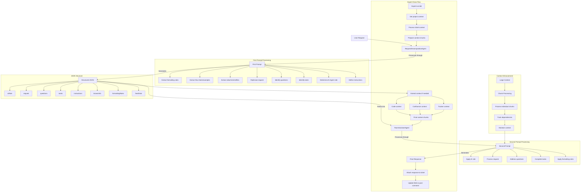

# DMTools Server API Documentation

## Overview

DMTools Server provides REST APIs for presentation generation, job execution, and development management tools. The server includes comprehensive OpenAPI/Swagger documentation accessible via web interface.

## Quick Start

1. **Start the server**:
   ```bash
   ./gradlew bootRun
   ```

2. **Access API documentation**:
   - **Swagger UI**: `http://localhost:8080/swagger-ui.html`
   - **OpenAPI Spec**: `http://localhost:8080/v3/api-docs`

## API Categories

### 🔧 Job Management API
Execute jobs with various parameters for automation tasks.

### 📊 Presentation Management API  
Create and manage presentations with dynamic content generation.

### 🤖 Agent & Orchestrator APIs
Access AI-powered agents and orchestration workflows.

### 💬 Chat API
AI-powered chat with MCP tools integration for real-time data access.

### 🔐 Authentication API
OAuth2 and security management endpoints.

## Base URLs

- **Local Development**: `http://localhost:8080`
- **Production**: Configure in `application.properties`

## Using the API

For detailed API documentation including:
- Request/response schemas
- Parameter descriptions
- Example requests
- Error codes and responses
- Authentication requirements

**Visit the Swagger UI at: `http://localhost:8080/swagger-ui.html`**

## Error Handling

All endpoints return appropriate HTTP status codes:
- **200 OK**: Successful operation
- **400 Bad Request**: Invalid request parameters
- **401 Unauthorized**: Authentication required
- **403 Forbidden**: Insufficient permissions
- **500 Internal Server Error**: Server-side errors

## Configuration

Server configuration is managed through `application.properties`. See the main README.md for detailed configuration options.

## Support

For issues or questions:
- Check the [GitHub Issues](https://github.com/IstiN/dmtools/issues)
- Review the [main documentation](README.md)
- Use the Swagger UI for interactive API exploration

## Diagram

[Diagram](https://mermaid.live/edit#pako:eNp9ltty4jgQhl9FpWuSGZ8gcLFVDIcsmZw2ZG5G5EJjt0EDlrySPCGb5N23bSvggBOqqMLqT1YffnXzTGOVAB3QdKMe4xXXltyPF5LgZ8h-GNDkDv4twNgHcnLyF_nG3OMYYpXlyggrlBwuQdqHete3knu51SoGY8AQu9KqWK5eyIhNhTaWoCnL3-hRRZ-DBM0tmBcyZnOri9gWGhJyMb-5duC4AqcAiSFCWvVCJuweeDY0RhjLpW36MPnIhymbo98yee_E9NCJc3RV8g2GbnIlDSBXk6b4tdQ8X5EFbQZD3FFCLhe0JnfBkZHHJlureWxJqnTGrUWM6GID5uGI9fcsPJ6YlbLmC2x5lrfSwY7Gt_J4lWEKzJdUtMIhli5faW6AaFfSIyZiswTfIdInUhFY25Y3dfeU5WbdQvTYGCzoTEggwxmpakO02sAxeoZoWnJCmqryjTNBJi2ZL1VBdippJrwSCRl7jIu794c5i8-OQ3emgLVF7IwhOwzUGSLW4nbD3mVrqR7lTKbq2Nhje0HcHejBIWcMdTAvZfBpSt6p-gM1VionU48N83zzVJbloCAO8Jnb3yIThwRsmCS6RNpy5qCQjVSpWwtHKnFE5Fz54Fq0hzpS0sLWkolccRlDKflmlH-zS66XQBxWd60ZG60KuW4kpuHMrEa8XdhCJuKPSApsAHG5ren5zKtpn93jvVuTBHJ0E2Qs3lVv5tdYwK44div8ktg51ICCOg2fRTvZ5oAtebTh6NgUW3Qz1gtWm091IS_UrzrW7-wcLMm1-g3YF45P_V5Rl7torYjX0AZeVuAVgpBzDW_EcU6u6slwqN3rsjlhVLuNIiUS-zckjb3XNeqhVhJoccLZfbTLdFNgoj-hgrooOLNakLpwN66zfxjMdV25m8ZKcLhyUy1M9gvn1cItG1ZdGO9NPTaIVS69jQNuK_Yf9iNPcNiQVMAmIUoTnKVlFbJsP8YwebRDM-yjXCQ4op_L5QW1K1T9gg7wZ8L1ulTEK3K8sGr-JGM6wH4EHVqNPDpI-cbgU1EdNxYclZW9ITmXP5VqPtLBM93SwYnnh_3T3tco8sKzvhd87YYd-lSt90673fAsiBDo9fr98LVD_6ve4Z8Gfq8feH4URlHU9f0OhURYpa_qPxjV_4wOXeoyFudieXf0SBXS0oHXC4PX_wG8FJQg)




