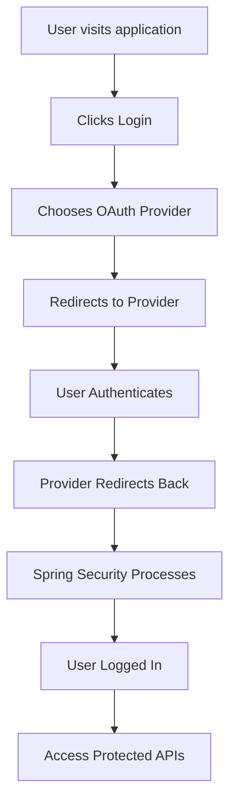

# OAuth2 Setup Guide - DMTools Application

## 🎯 Overview

This guide covers **complete OAuth2 authentication setup** for DMTools application with **Google**, **Microsoft**, and **GitHub** providers for both development and production environments.

### 🔧 What You'll Configure

- ✅ **Google OAuth2** - For Gmail/Google Workspace users
- ✅ **Microsoft OAuth2** - For Outlook/Office 365 users  
- ✅ **GitHub OAuth2** - For GitHub users
- ✅ **Production Deployment** - Cloud Run configuration
- ✅ **GitHub Actions** - Automated deployment with secrets

---

## 📋 Prerequisites

- [ ] Google Cloud Console access
- [ ] Microsoft Azure Portal access
- [ ] GitHub account with admin access
- [ ] GitHub repository with Actions enabled
- [ ] GCP project with Cloud Run enabled

---

## 🔐 OAuth Provider Setup

### 1. Google OAuth Configuration

#### **Step 1: Create Google OAuth Client**
1. Go to [Google Cloud Console](https://console.cloud.google.com/)
2. Select your project or create a new one
3. Navigate to **APIs & Services** → **Credentials**
4. Click **+ CREATE CREDENTIALS** → **OAuth 2.0 Client IDs**
5. Choose **Web application**
6. Fill in the details:
   ```
   Name: DMTools Production
   Authorized JavaScript origins: 
     - https://dmtools-431977789017.us-central1.run.app
   Authorized redirect URIs:
     - https://dmtools-431977789017.us-central1.run.app/login/oauth2/code/google
   ```
7. Click **CREATE**
8. **Copy the Client ID and Client Secret** 📋

#### **Step 2: Enable Required APIs**
1. Go to **APIs & Services** → **Library**
2. Search and enable:
   - **Google+ API**
   - **People API**
   - **OpenID Connect API**

---

### 2. Microsoft OAuth Configuration

#### **Step 1: Create Microsoft App Registration**
1. Go to [Azure Portal](https://portal.azure.com/)
2. Navigate to **Microsoft Entra ID** → **App registrations**
3. Click **+ New registration**
4. Fill in the details:
   ```
   Name: DMTools Production
   Supported account types: Accounts in any organizational directory and personal Microsoft accounts
   Redirect URI: Web → https://dmtools-431977789017.us-central1.run.app/login/oauth2/code/microsoft
   ```
5. Click **Register**
6. **Copy the Application (client) ID** 📋

#### **Step 2: Configure Client Secret**
1. In your new app registration, go to **Certificates & secrets**
2. Click **+ New client secret**
3. Add description: `DMTools Production Secret`
4. Choose expiration: `24 months` (recommended)
5. Click **Add**
6. **Copy the secret value immediately** (you won't see it again!) 📋

#### **Step 3: Configure API Permissions**
1. Go to **API permissions**
2. Click **+ Add a permission**
3. Choose **Microsoft Graph**
4. Select **Delegated permissions**
5. Add these permissions:
   - `openid`
   - `profile`
   - `email`
   - `User.Read`
6. Click **Add permissions**
7. Click **Grant admin consent** (if you have admin rights)

---

### 3. GitHub OAuth Configuration

#### **Step 1: Create GitHub OAuth App**
1. Go to [GitHub Settings](https://github.com/settings/developers)
2. Click **Developer settings** → **OAuth Apps**
3. Click **New OAuth App**
4. Fill in the details:
   ```
   Application name: DMTools Production
   Homepage URL: https://dmtools-431977789017.us-central1.run.app
   Authorization callback URL: https://dmtools-431977789017.us-central1.run.app/login/oauth2/code/github
   ```
5. Click **Register application**
6. **Copy the Client ID** 📋
7. Click **Generate a new client secret** and **copy it** 📋

---

## 🚀 GitHub Repository Configuration

### Step 1: Configure GitHub Secrets

Go to your repository → **Settings** → **Secrets and variables** → **Actions**

#### **Secrets** (click **New repository secret**):

| Secret Name | Value | Description |
|-------------|-------|-------------|
| `GOOGLE_CLIENT_SECRET` | `your-google-client-secret` | Google OAuth client secret |
| `MICROSOFT_CLIENT_SECRET` | `your-microsoft-client-secret` | Microsoft OAuth client secret |
| `OAUTH_GITHUB_CLIENT_SECRET` | `your-github-client-secret` | GitHub OAuth client secret |
| `JWT_SECRET` | `your-super-long-jwt-secret` | JWT signing key (generate with `openssl rand -base64 64`) |
| `GEMINI_API_KEY` | `your-gemini-api-key` | Gemini AI API key |
| `GCP_SA_KEY` | `your-gcp-service-account-json` | GCP service account JSON |

#### **Variables** (click **New repository variable**):

| Variable Name | Value | Description |
|---------------|-------|-------------|
| `GCP_PROJECT_ID` | `dmtools-oauth-1749672403` | GCP project ID |
| `GEMINI_DEFAULT_MODEL` | `gemini-2.5-flash-preview-05-20` | Gemini model name |

---

### Step 2: Update Workflow Configuration

Edit `.github/workflows/deploy-gcp.yml` and update the client IDs (around lines 95-110):

```yaml
# Replace these with your actual OAuth client IDs
GOOGLE_CLIENT_ID: "YOUR_NEW_GOOGLE_CLIENT_ID"
MICROSOFT_CLIENT_ID: "YOUR_NEW_MICROSOFT_CLIENT_ID"  
GITHUB_CLIENT_ID: "YOUR_NEW_GITHUB_CLIENT_ID"

# Also update these Spring Security configuration lines
SPRING_SECURITY_OAUTH2_CLIENT_REGISTRATION_GOOGLE_CLIENT_ID: "YOUR_NEW_GOOGLE_CLIENT_ID"
SPRING_SECURITY_OAUTH2_CLIENT_REGISTRATION_GITHUB_CLIENT_ID: "YOUR_NEW_GITHUB_CLIENT_ID"
SPRING_SECURITY_OAUTH2_CLIENT_REGISTRATION_MICROSOFT_CLIENT_ID: "YOUR_NEW_MICROSOFT_CLIENT_ID"
```

---

## 🏗️ Production Deployment

### Step 1: Deploy with New Configuration
1. **Commit your changes** to the workflow file
2. **Push to main branch**
3. **Trigger deployment**:
   ```bash
   gh workflow run "Deploy to GCP Cloud Run" --field environment=production
   ```

### Step 2: Verify Deployment
Check that your application is running:
```bash
curl -s -o /dev/null -w "Status: %{http_code}\n" https://dmtools-431977789017.us-central1.run.app
```

---

## ✅ Testing Your OAuth Configuration

### **Production OAuth URLs**

Test each provider by visiting these URLs:

| Provider | OAuth URL |
|----------|-----------|
| **Google** | `https://dmtools-431977789017.us-central1.run.app/oauth2/authorization/google` |
| **Microsoft** | `https://dmtools-431977789017.us-central1.run.app/oauth2/authorization/microsoft` |
| **GitHub** | `https://dmtools-431977789017.us-central1.run.app/oauth2/authorization/github` |

### **Application URLs**

| Endpoint | URL | Expected Response |
|----------|-----|-------------------|
| **Main App** | `https://dmtools-431977789017.us-central1.run.app` | 302 → Swagger UI |
| **Health Check** | `https://dmtools-431977789017.us-central1.run.app/actuator/health` | 200 OK |
| **Swagger UI** | `https://dmtools-431977789017.us-central1.run.app/swagger-ui/index.html` | 200 OK |
| **API Config** | `https://dmtools-431977789017.us-central1.run.app/api/config` | 302 → Login |

---

## 🔄 Complete Login Flow



### **Detailed Flow Example (Google)**
```
1. User visits: https://dmtools-431977789017.us-central1.run.app
2. Clicks Login → Chooses Google
3. Redirects to: /oauth2/authorization/google
4. Spring Security redirects to: https://accounts.google.com/oauth/authorize?...
5. User authenticates with Google
6. Google redirects to: /login/oauth2/code/google?code=...
7. Spring Security exchanges code for token
8. User profile extracted from Google APIs
9. User is logged in with session
10. Can access protected APIs
```

---

## 🔒 Security Configuration Applied

### **CORS Configuration**
```java
// Allows cross-origin requests for all endpoints
configuration.setAllowedOriginPatterns(List.of("*"));
configuration.setAllowedMethods(List.of("GET", "POST", "PUT", "DELETE", "OPTIONS", "PATCH"));
configuration.setAllowCredentials(true);
```

### **HTTPS Security Headers**
```java
// HSTS and security headers for Cloud Run
.httpStrictTransportSecurity(hstsConfig -> hstsConfig
    .maxAgeInSeconds(31536000)
    .includeSubDomains(true))
.frameOptions().deny()
.contentTypeOptions().and()
```

### **Proxy Configuration**
```yaml
# Cloud Run proxy configuration
SERVER_FORWARD_HEADERS_STRATEGY: "FRAMEWORK"
SERVER_USE_FORWARD_HEADERS: "true"
```

---

## 🛠️ Environment Variables Reference

### **Required for Production**

```bash
# OAuth2 Configuration
GOOGLE_CLIENT_ID="your-google-client-id"
GOOGLE_CLIENT_SECRET="your-google-client-secret"
MICROSOFT_CLIENT_ID="your-microsoft-client-id"  
MICROSOFT_CLIENT_SECRET="your-microsoft-client-secret"
GITHUB_CLIENT_ID="your-github-client-id"
GITHUB_CLIENT_SECRET="your-github-client-secret"

# Spring Security OAuth2 (auto-configured by workflow)
SPRING_SECURITY_OAUTH2_CLIENT_REGISTRATION_GOOGLE_*
SPRING_SECURITY_OAUTH2_CLIENT_REGISTRATION_MICROSOFT_*
SPRING_SECURITY_OAUTH2_CLIENT_REGISTRATION_GITHUB_*

# Application Configuration
APP_BASE_URL="https://dmtools-431977789017.us-central1.run.app"
SPRING_PROFILES_ACTIVE="prod"
JWT_SECRET="your-jwt-secret"

# Cloud Run Configuration
SERVER_FORWARD_HEADERS_STRATEGY="FRAMEWORK"
SERVER_USE_FORWARD_HEADERS="true"
```

---

## 🚨 Troubleshooting

### **Common OAuth Errors**

| Error | Cause | Solution |
|-------|-------|----------|
| `redirect_uri_mismatch` | URL doesn't match OAuth config | Check exact URL spelling in provider settings |
| `unauthorized_client` | Client ID mismatch | Verify client ID in GitHub workflow matches provider |
| `access_denied` | Missing permissions | Check API permissions (especially Microsoft Graph) |
| `invalid_client` | Client secret wrong | Regenerate and update client secret |

### **CORS/Network Errors**

| Error | Cause | Solution |
|-------|-------|----------|
| `Fetch API cannot load` | CORS not configured | Already fixed - CORS enabled for all endpoints |
| `Mixed content` | HTTP in HTTPS page | Already fixed - proxy headers configured |
| `ERR_SSL_PROTOCOL_ERROR` | HTTPS issue | Check Cloud Run deployment logs |

### **Debug Commands**

```bash
# Check deployment status
gcloud run services describe dmtools --region=us-central1 --project=dmtools-oauth-1749672403

# View application logs  
gcloud logs read "resource.type=cloud_run_revision" --project=dmtools-oauth-1749672403 --limit=50

# Test endpoints
curl -I https://dmtools-431977789017.us-central1.run.app
curl -I https://dmtools-431977789017.us-central1.run.app/actuator/health
```

---

## 🔄 Maintenance

### **Secret Rotation Schedule**
- **Google/Microsoft secrets**: Expire in 24 months, set calendar reminder
- **GitHub secrets**: No expiration, rotate annually
- **JWT secret**: Rotate every 6-12 months

### **Monitoring Checklist**
- [ ] OAuth provider status pages
- [ ] Cloud Run application health
- [ ] SSL certificate expiration
- [ ] GitHub Actions workflow success
- [ ] User authentication success rates

---

## 🎉 Setup Complete!

Your DMTools application now supports:

✅ **Multi-Provider OAuth2**: Google, Microsoft, GitHub  
✅ **Production Ready**: Deployed on Cloud Run with HTTPS  
✅ **Secure Configuration**: CORS, HSTS, proxy headers  
✅ **Automated Deployment**: GitHub Actions with secrets  
✅ **Monitoring Ready**: Health checks and logging  

### **Next Steps**
1. Test all OAuth providers
2. Monitor authentication success rates
3. Set up log monitoring and alerts
4. Plan secret rotation schedule
5. Document user onboarding process

---

**🚀 Your OAuth2 authentication system is now production-ready!** 