# DMTools - Architecture Documentation

## Multi-Module System Architecture

DMTools is designed as a **multi-module Gradle project** with clear architectural boundaries between business logic and presentation layers.

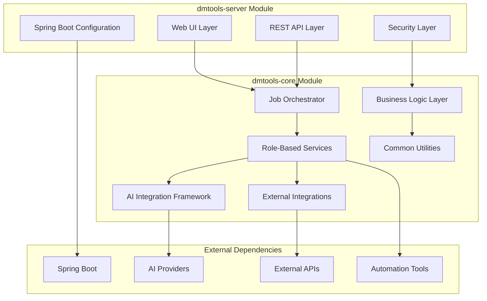

### Module Responsibilities

- **dmtools-server**: Web services, authentication, REST APIs, UI
- **dmtools-core**: Business logic, integrations, AI framework, job execution

## System Architecture Overview

DMTools follows a layered, modular architecture designed for scalability, maintainability, and extensibility. The system is built around a plugin-based job execution framework with AI integration at its core.

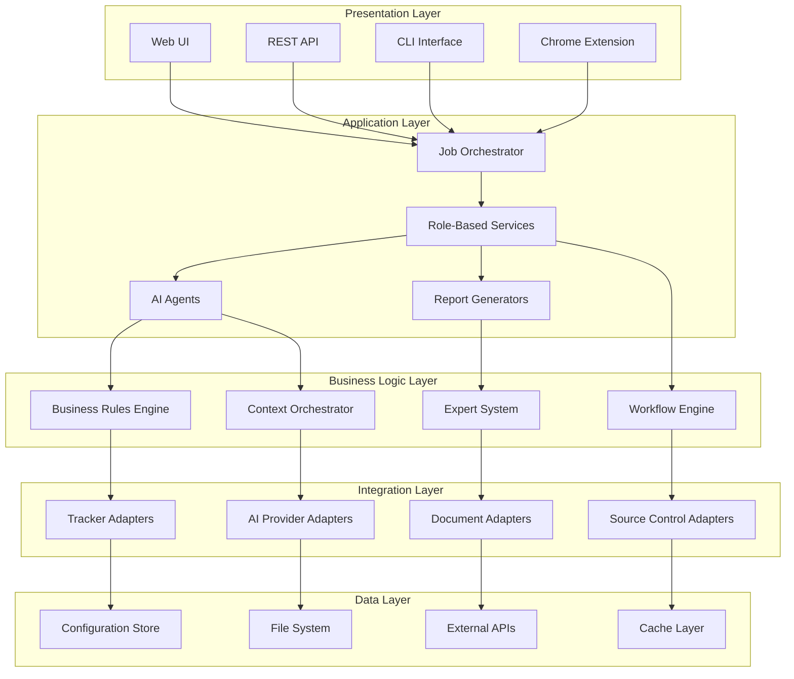

## Core Components

### 1. Job Execution Framework

The foundation of DMTools is its flexible job execution system that allows for pluggable, parameterized tasks.

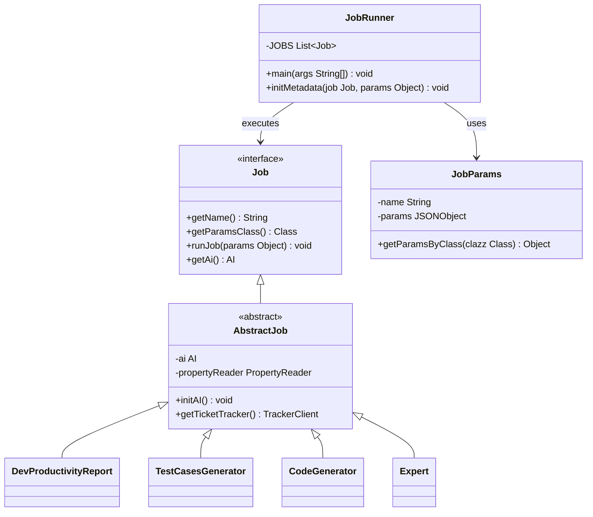

### 2. AI Integration Architecture

DMTools provides a flexible AI abstraction layer supporting multiple providers and specialized agents.

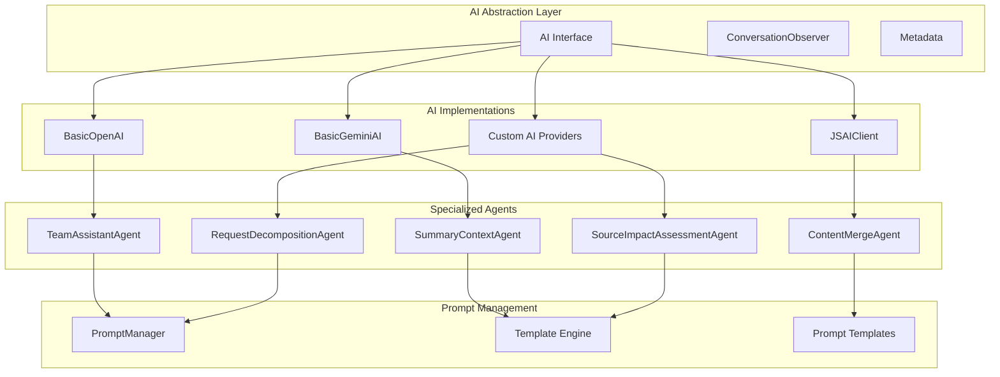

### 3. Integration Architecture

The system integrates with multiple external services through a unified adapter pattern.

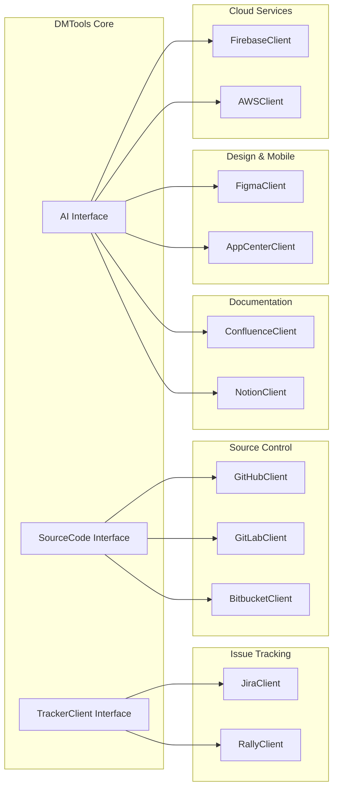

### 4. Role-Based Module Architecture

Each role has dedicated modules with specific capabilities and workflows.

```mermaid
graph TB
    subgraph "Business Analyst"
        A[RequirementsCollector]
        B[UserStoryGenerator]
        C[BusinessAnalyticDORGeneration]
        D[BAProductivityReport]
    end
    
    subgraph "Developer"
        E[CodeGenerator]
        F[UnitTestsGenerator]
        G[CommitsTriage]
        H[DevProductivityReport]
    end
    
    subgraph "QA Engineer"
        I[TestCasesGenerator]
        J[AutomationTester]
        K[QAProductivityReport]
        L[TestExecutionFramework]
    end
    
    subgraph "Scrum Master"
        M[ScrumMasterDaily]
        N[SprintAnalytics]
        O[TeamMetrics]
    end
    
    subgraph "Solution Architect"
        P[SolutionArchitectureCreator]
        Q[DiagramsCreator]
        R[TechnicalSpecification]
    end
    
    subgraph "Shared Services"
        S[AI Service]
        T[Integration Service]
        U[Report Service]
        V[Context Service]
    end
    
    A --> S
    B --> S
    E --> S
    F --> S
    I --> S
    J --> S
    M --> S
    P --> S
    
    A --> T
    E --> T
    I --> T
    M --> T
    P --> T
    
    C --> U
    G --> U
    K --> U
    N --> U
    Q --> U
    
    B --> V
    F --> V
    J --> V
    O --> V
    R --> V
```

## Data Flow Architecture

### 1. Request Processing Flow

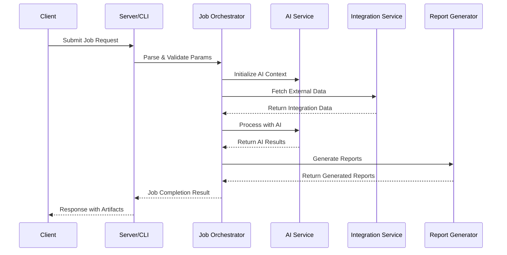

### 2. AI Processing Flow

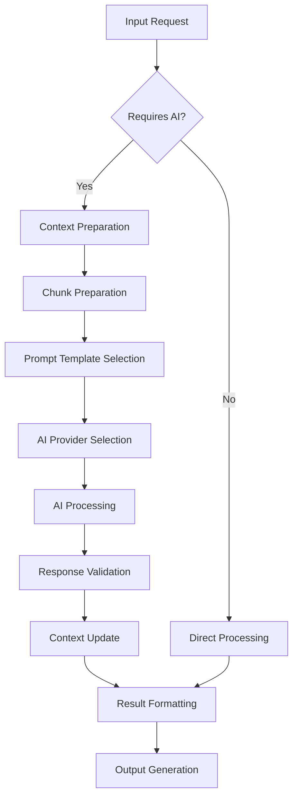

### 3. Integration Data Flow

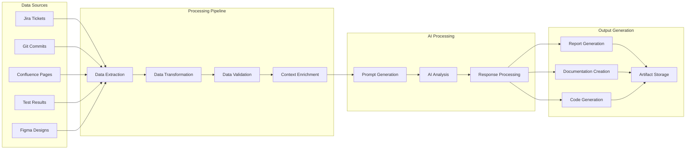

## Automation Architecture

### Web and Mobile Automation Framework

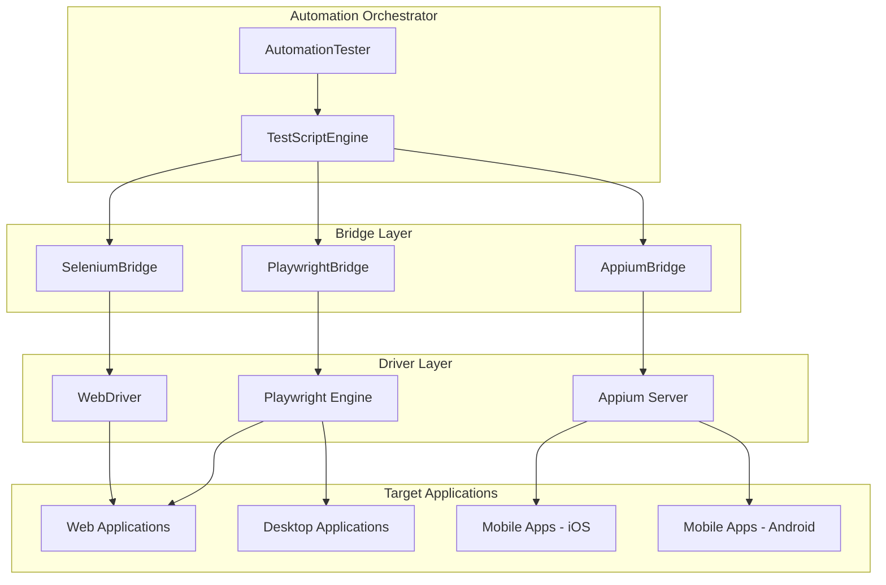

## Configuration and Deployment Architecture

### Configuration Management

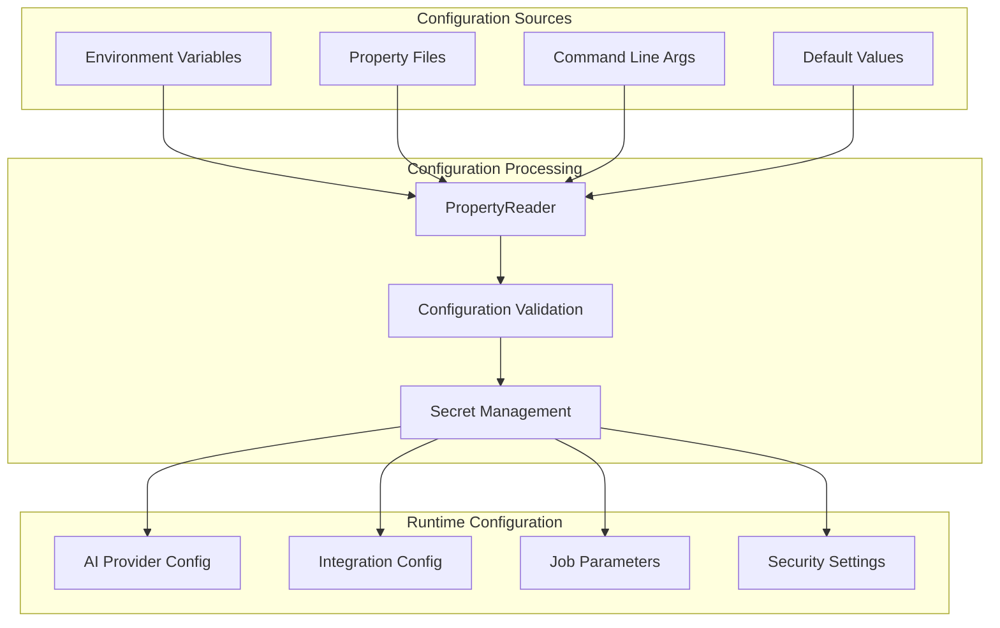

### Deployment Options

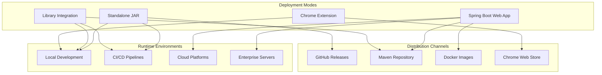

## Security Architecture

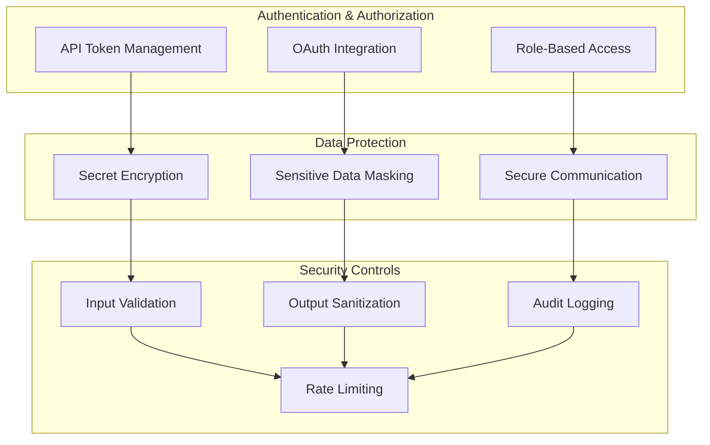

## Key Architectural Principles

### 1. **Modularity**
- Clear separation of concerns
- Pluggable architecture
- Independent deployable modules

### 2. **Extensibility**
- Interface-based design
- Plugin architecture
- Configuration-driven behavior

### 3. **Scalability**
- Asynchronous processing
- Caching strategies
- Resource optimization

### 4. **Reliability**
- Error handling and recovery
- Logging and monitoring
- Graceful degradation

### 5. **Security**
- Secure credential management
- Data encryption
- Audit trails

### 6. **Maintainability**
- Clean code principles
- Comprehensive testing
- Documentation standards

This architecture enables DMTools to serve as a comprehensive platform for software development lifecycle automation while maintaining flexibility and extensibility for future enhancements. 