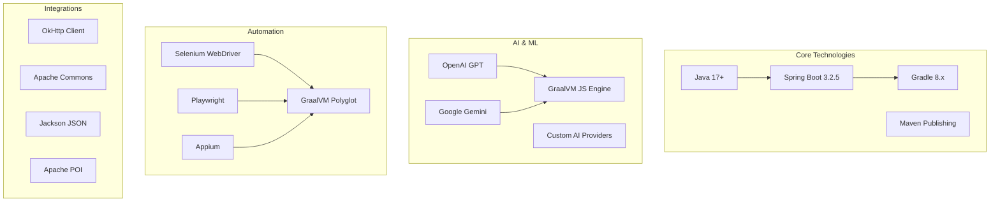

# DMTools - Project Overview

## Introduction

DMTools (Delivery Management Tools) is a comprehensive Java-based framework designed to automate and streamline various aspects of software development lifecycle management. The platform provides a unified approach to integrating multiple development tools, tracking systems, and AI-powered automation to enhance productivity across different roles in software development teams.

## Purpose and Vision

DMTools aims to bridge the gap between various development tools and processes by providing:
- **Unified Integration**: Single framework to connect Jira, Confluence, GitHub, GitLab, Bitbucket, and other tools
- **AI-Powered Automation**: Leverage AI for code generation, documentation, testing, and analysis
- **Role-Based Workflows**: Specialized tools for Business Analysts, Developers, QA Engineers, Scrum Masters, and Solution Architects
- **Productivity Analytics**: Comprehensive reporting and metrics collection
- **Automation-First Approach**: Reduce manual tasks through intelligent automation

## Key Features

### 🤖 AI Integration
- Multiple AI provider support (OpenAI, Gemini, custom implementations)
- Intelligent code generation and review
- Automated documentation creation
- Test case generation
- Requirements analysis and user story creation

### 🔧 Development Tools Integration
- **Source Control**: GitHub, GitLab, Bitbucket
- **Project Management**: Jira, Rally
- **Documentation**: Confluence
- **Design Tools**: Figma
- **Mobile Development**: AppCenter
- **Cloud Services**: Firebase, AWS

### 📊 Analytics and Reporting
- Developer productivity metrics
- QA productivity analysis
- Business analyst performance tracking
- Code quality assessments
- Sprint and project analytics

### 🎯 Role-Specific Features
- **Business Analysts**: Requirements collection, user story generation, DOR creation
- **Developers**: Code generation, unit test creation, commit analysis
- **QA Engineers**: Test case generation, automation scripting
- **Scrum Masters**: Daily standup automation, sprint analytics
- **Solution Architects**: Architecture documentation, technical specifications

### 🚀 Automation Capabilities
- Web automation (Selenium, Playwright)
- Mobile automation (Appium)
- PDF processing and generation
- Excel report generation
- Chrome extension support

## Technology Stack

## Architecture Highlights

- **Modular Design**: Clear separation of concerns with dedicated packages for each domain
- **Dependency Injection**: Dagger 2 for clean dependency management
- **Plugin Architecture**: Extensible job system with pluggable components
- **Multi-Threading**: Concurrent processing for improved performance
- **Configuration-Driven**: Environment-based configuration management
- **RESTful Services**: Spring Boot web services for remote job execution

## Project Structure

The project follows a domain-driven design approach with the following key areas:

- **AI & Automation**: Core AI integration and automation frameworks
- **Integrations**: Third-party service connectors and APIs
- **Role-Based Modules**: Domain-specific functionality for different team roles
- **Common Utilities**: Shared components and utilities
- **Job Framework**: Pluggable job execution system
- **Server Components**: Web service layer for remote execution

## Getting Started

DMTools can be used in multiple ways:

1. **Standalone JAR**: Download and run as a command-line tool
2. **Web Service**: Deploy as a Spring Boot application
3. **Library Integration**: Include as a dependency in your projects
4. **Chrome Extension**: Browser-based automation and integration

## Use Cases

### Primary Use Cases
- **Automated Reporting**: Generate productivity and performance reports
- **AI-Assisted Development**: Code generation, review, and testing
- **Documentation Automation**: Generate and maintain technical documentation
- **Quality Assurance**: Automated test case generation and execution
- **Project Management**: Automated task tracking and sprint management

### Industry Applications
- **Software Development Teams**: End-to-end development lifecycle automation
- **Digital Agencies**: Client project management and delivery
- **Enterprise IT**: Large-scale development process standardization
- **Consulting**: Productivity analysis and process optimization

## Community and Ecosystem

- **Open Source**: MIT Licensed for maximum flexibility
- **Extensible**: Plugin architecture for custom integrations
- **Community-Driven**: Accepts contributions and feature requests
- **Enterprise-Ready**: Production-tested in various environments

## Future Roadmap

- Enhanced AI model support and fine-tuning capabilities
- Extended mobile and web automation features
- Advanced analytics and machine learning insights
- Cloud-native deployment options
- GraphQL API layer
- Real-time collaboration features

---

*DMTools represents a comprehensive approach to modern software development lifecycle management, combining the power of AI with proven development tools and practices.* 