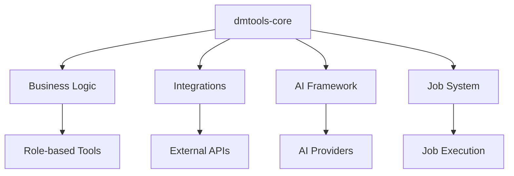
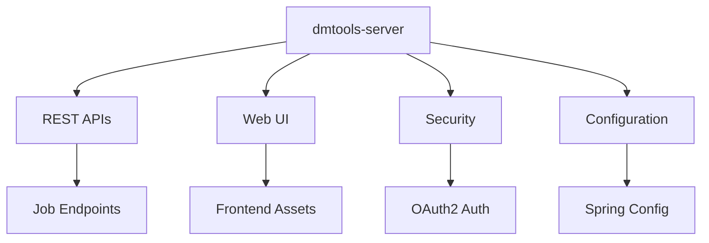
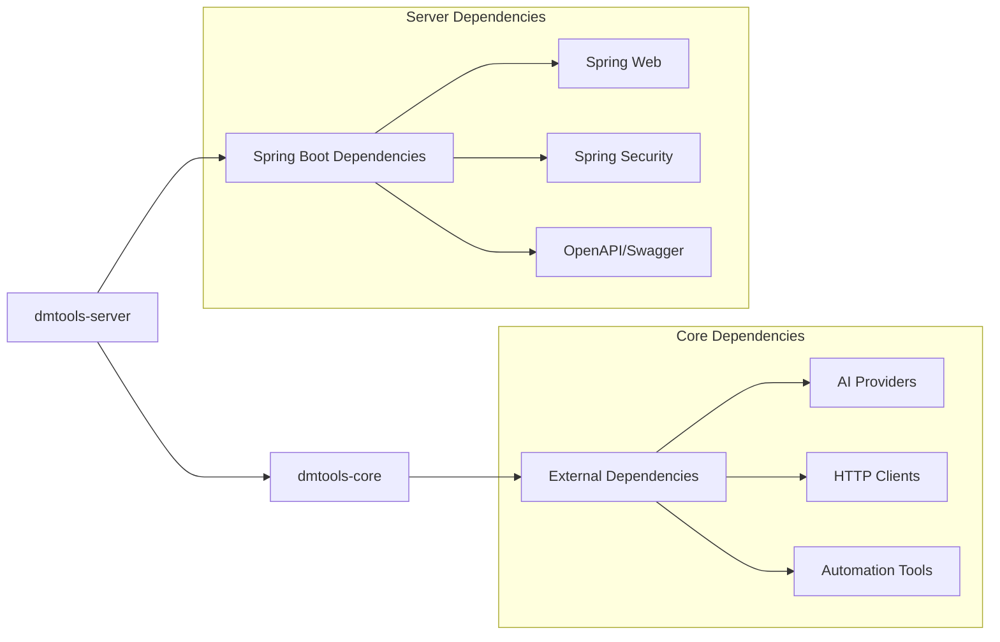

# DMTools - Project Structure

## Multi-Module Architecture

DMTools is a **multi-module Gradle project** with clear separation between core business logic and web service layers.

```
dmtools/
├── 📁 dmtools-core/                     # Core business logic module
│   ├── 📁 src/
│   │   ├── 📁 main/java/                # Core source code
│   │   ├── 📁 main/resources/           # Core resources
│   │   └── 📁 test/                     # Core unit tests
│   ├── 📄 build.gradle                  # Core module build config
│   ├── 📁 screenshots/                  # Test screenshots
│   ├── 📁 reports/                      # Generated reports
│   └── 📁 cache*/                       # Cache directories
├── 📁 dmtools-server/                   # Spring Boot web service module
│   ├── 📁 src/
│   │   ├── 📁 main/java/                # Server source code
│   │   ├── 📁 main/resources/           # Server resources & config
│   │   └── 📁 test/                     # Server unit tests
│   ├── 📄 build.gradle                  # Server module build config
│   └── 📁 data/                         # Server data files
├── 📁 chrome_extension/                 # Browser extension
├── 📁 prototyping/                      # Prototype code
├── 📁 documentation/                    # Project documentation
├── 📁 jai_config/                       # AI configuration
├── 📁 test_data/                        # Test datasets
├── 📁 cache*/                           # Various cache directories
├── 📄 build.gradle                      # Root build configuration
├── 📄 settings.gradle                   # Multi-module configuration
├── 📄 README.md                         # Project README
└── 📄 LICENSE                           # MIT License
```

## Module Structure

### 🔧 dmtools-core (Business Logic Module)

The core module contains all business logic, integrations, and domain-specific functionality.



**Package Structure:**
```
dmtools-core/src/main/java/com/github/istin/dmtools/
├── 📁 ai/                              # AI integration framework
├── 📁 atlassian/                       # Jira & Confluence integration
│   ├── 📁 jira/                        # Jira API client
│   └── 📁 confluence/                  # Confluence API client
├── 📁 github/                          # GitHub integration
├── 📁 gitlab/                          # GitLab integration
├── 📁 microsoft/                       # Microsoft services integration
├── 📁 firebase/                        # Firebase integration
├── 📁 aws/                             # AWS integration
├── 📁 broadcom/                        # Broadcom Rally integration
├── 📁 figma/                           # Figma API integration
├── 📁 ba/                              # Business Analyst tools
├── 📁 dev/                             # Developer tools
├── 📁 qa/                              # Quality Assurance tools
├── 📁 sm/                              # Scrum Master tools
├── 📁 sa/                              # Solution Architect tools
├── 📁 job/                             # Job execution framework
├── 📁 expert/                          # Expert system
├── 📁 common/                          # Shared utilities
├── 📁 report/                          # Reporting framework
├── 📁 metrics/                         # Metrics collection
├── 📁 automation/                      # Automation frameworks
├── 📁 context/                         # Context management
├── 📁 search/                          # Search orchestration
├── 📁 documentation/                   # Documentation tools
├── 📁 presentation/                    # Presentation generation
├── 📁 pdf/                             # PDF processing
├── 📁 excel/                           # Excel processing
├── 📁 file/                            # File utilities
├── 📁 team/                            # Team management
├── 📁 vacation/                        # Vacation tracking
├── 📁 sync/                            # Synchronization tools
├── 📁 networking/                      # Network utilities
├── 📁 graphql/                         # GraphQL integration
├── 📁 robot/                           # Robotic automation
├── 📁 estimations/                     # Project estimation
├── 📁 diagram/                         # Diagram generation
├── 📁 bridge/                          # System bridges
├── 📁 dto/                             # Data transfer objects
├── 📁 di/                              # Dependency injection
├── 📁 openai/                          # OpenAI integration
├── 📁 prompt/                          # Prompt management
└── 📁 apps/                            # Application utilities
```

### 🌐 dmtools-server (Web Service Module)

The server module provides REST APIs, web UI, and Spring Boot configuration.



**Package Structure:**
```
dmtools-server/src/main/java/com/github/istin/dmtools/
├── 📁 server/                          # Core server components
│   ├── 📁 config/                      # Spring configuration
│   └── 📄 *Controller.java             # REST controllers
├── 📁 auth/                            # Authentication & security
├── 📁 dto/                             # Server DTOs
├── 📁 common/                          # Server utilities
└── 📁 apps/                            # Server applications
```

**Resources:**
```
dmtools-server/src/main/resources/
├── 📄 application.properties           # Main Spring config
├── 📄 application-local.properties     # Local environment config
├── 📄 application-gcp.properties       # Google Cloud config
└── 📁 static/                          # Web UI assets
```

## Module Dependencies



The server module depends on the core module, which contains all the business logic and external integrations.

## Build Configuration

### Root Build (build.gradle)
- Defines common dependencies and configurations
- Shadow JAR plugin for fat JAR creation
- Multi-module project management

### Module Builds
- **dmtools-core/build.gradle**: Core business logic dependencies
- **dmtools-server/build.gradle**: Spring Boot and web dependencies

### Settings (settings.gradle)
```gradle
include 'dmtools-core', 'dmtools-server'
```

## Entry Points

### Main Application Classes
1. **`dmtools-server/.../DmToolsServerApplication.java`** - Spring Boot web application
2. **`dmtools-core/.../DMTools.java`** - Basic CLI entry point
3. **`dmtools-core/.../job/JobRunner.java`** - Command-line job execution

### REST API Endpoints (dmtools-server)
- `/api/executeJob` - Job execution endpoint
- `/api/config` - Configuration endpoint
- `/api/presentation/*` - Presentation APIs
- `/api/v1/agents/*` - Agent management APIs
- `/api/v1/chat/*` - Chat APIs with MCP tools
- `/swagger-ui.html` - API documentation

## Development Workflow

### Local Development
```bash
# Build all modules
./gradlew build

# Run server module
./gradlew :dmtools-server:bootRun

# Run specific job from core
./gradlew :dmtools-core:run --args="job-params"
```

### Testing
```bash
# Test all modules
./gradlew test

# Test specific module
./gradlew :dmtools-core:test
./gradlew :dmtools-server:test
```

### Deployment
```bash
# Build deployable JAR
./gradlew :dmtools-server:bootJar

# The JAR includes both modules
java -jar dmtools-server/build/libs/dmtools-server.jar
```

## Architecture Benefits

### ✅ Separation of Concerns
- **Core Module**: Business logic, integrations, job execution
- **Server Module**: Web services, UI, authentication

### ✅ Independent Testing
- Core business logic can be tested independently
- Server endpoints can be tested separately

### ✅ Flexible Deployment
- Deploy as web service (server module)
- Use as library (core module)
- CLI execution (core module)

### ✅ Clear Dependencies
- Server depends on core (not vice versa)
- Clean module boundaries
- Easier maintenance and development

This multi-module structure enables DMTools to be used flexibly as a web service, CLI tool, or library while maintaining clean architecture principles. 