# Knowledge Base Architecture

## Overview

The DMTools Knowledge Base (KB) system transforms unstructured data (chat messages, documents, transcripts) into a structured, searchable knowledge repository. It uses AI to extract semantic information and organize it into interconnected entities.

## High-Level Architecture

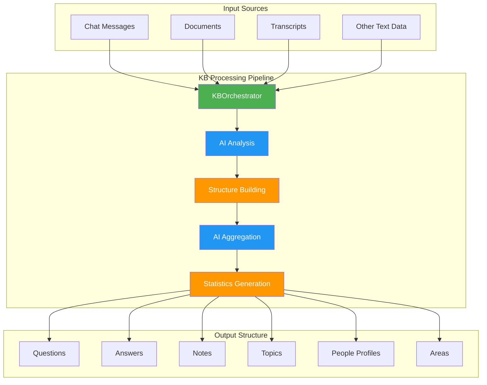

## Processing Modes

The KB system supports three processing modes for different use cases:

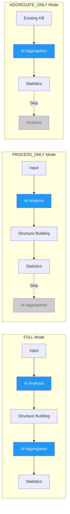

### Mode Descriptions

- **FULL**: Complete processing with AI analysis and aggregation (default)
- **PROCESS_ONLY**: Fast mode - structure only, no AI descriptions (for bulk data)
- **AGGREGATE_ONLY**: Generate AI descriptions for existing KB structure

## Core Components

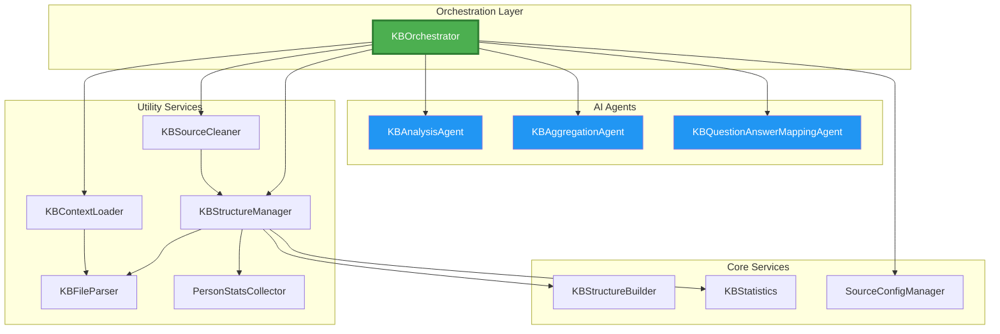

## Data Flow

### 1. Input Processing

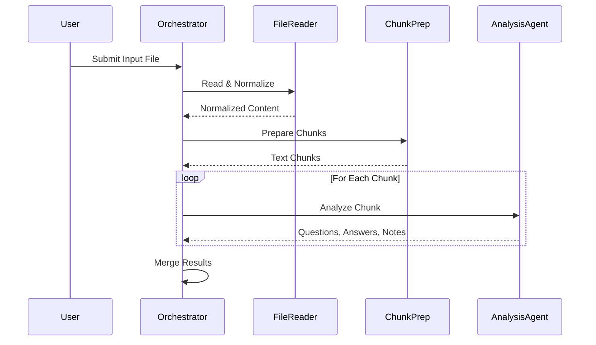

### 2. Structure Building

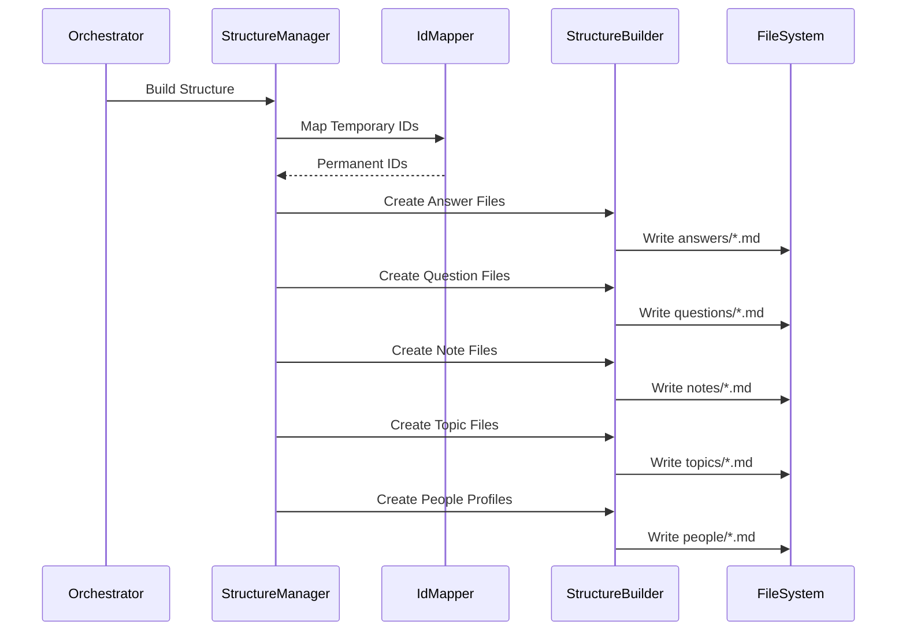

### 3. AI Aggregation

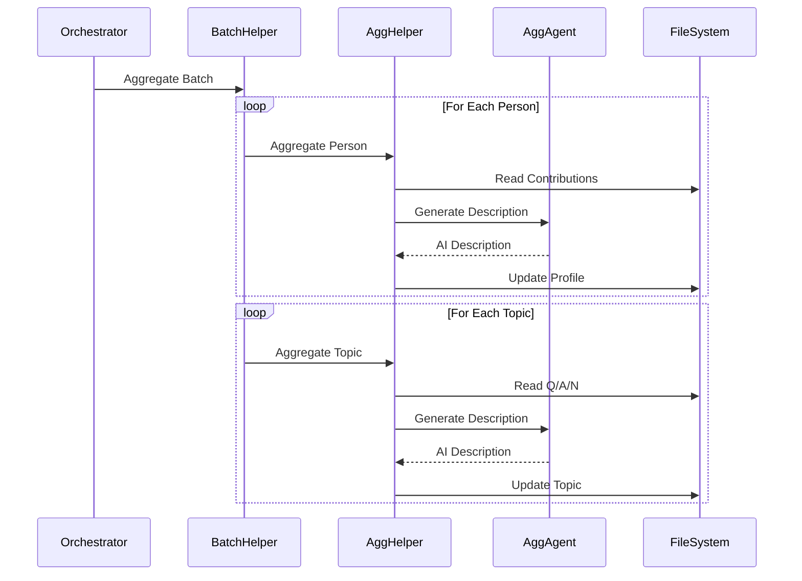

## Source Cleanup Architecture

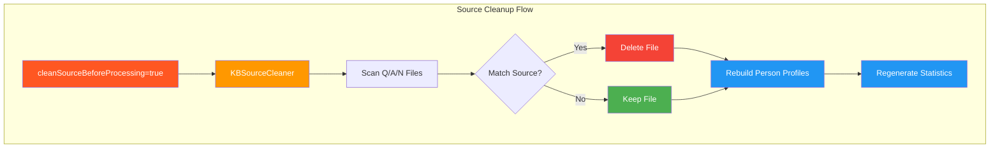

### Multi-Source Safety

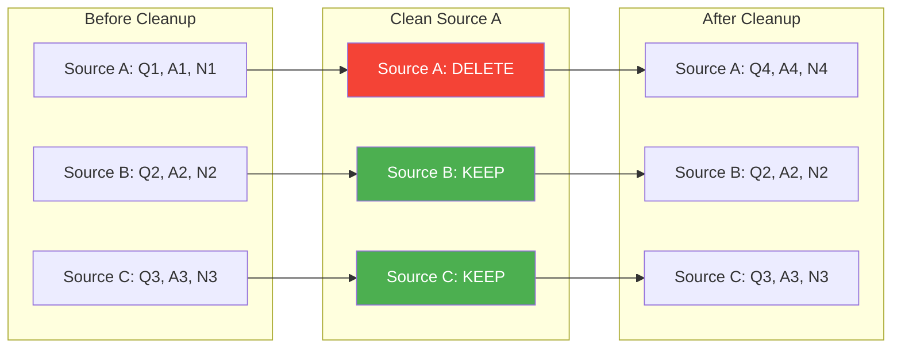

## Output Structure

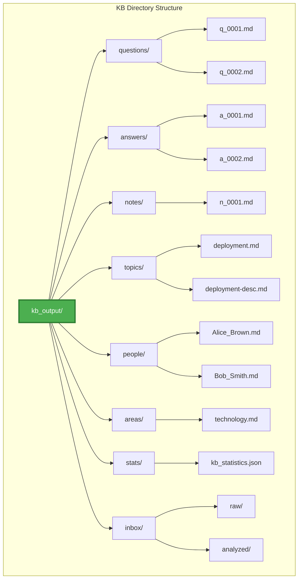

## Entity Relationships

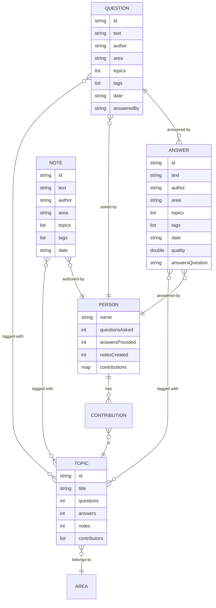

## Incremental Updates

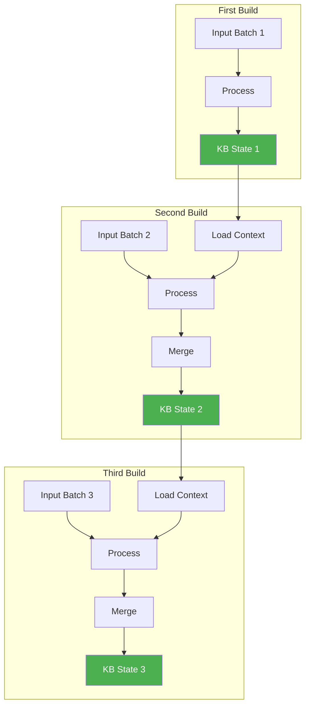

## Statistics & Indexing

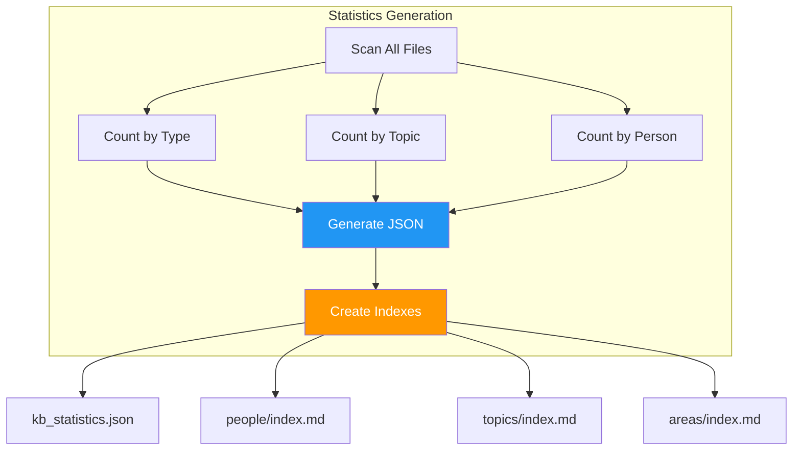

## Key Design Principles

### 1. **Separation of Concerns**
- **Orchestration**: `KBOrchestrator` coordinates workflow
- **AI Processing**: Agents handle AI interactions
- **Structure Management**: Utilities handle file operations
- **Statistics**: Separate service for metrics

### 2. **Incremental Processing**
- Load existing context before processing
- Merge new data with existing KB
- Preserve historical data
- Support partial updates

### 3. **Source Isolation**
- Each source tracked independently
- Clean individual sources without affecting others
- Automatic statistics recalculation
- Safe multi-source environments

### 4. **Error Recovery**
- Rollback on failures
- Track created files
- Clean up partial results
- Preserve KB integrity

### 5. **Scalability**
- Chunk large inputs
- Parallel processing where possible
- Efficient file scanning
- Optimized ID mapping

## Performance Considerations

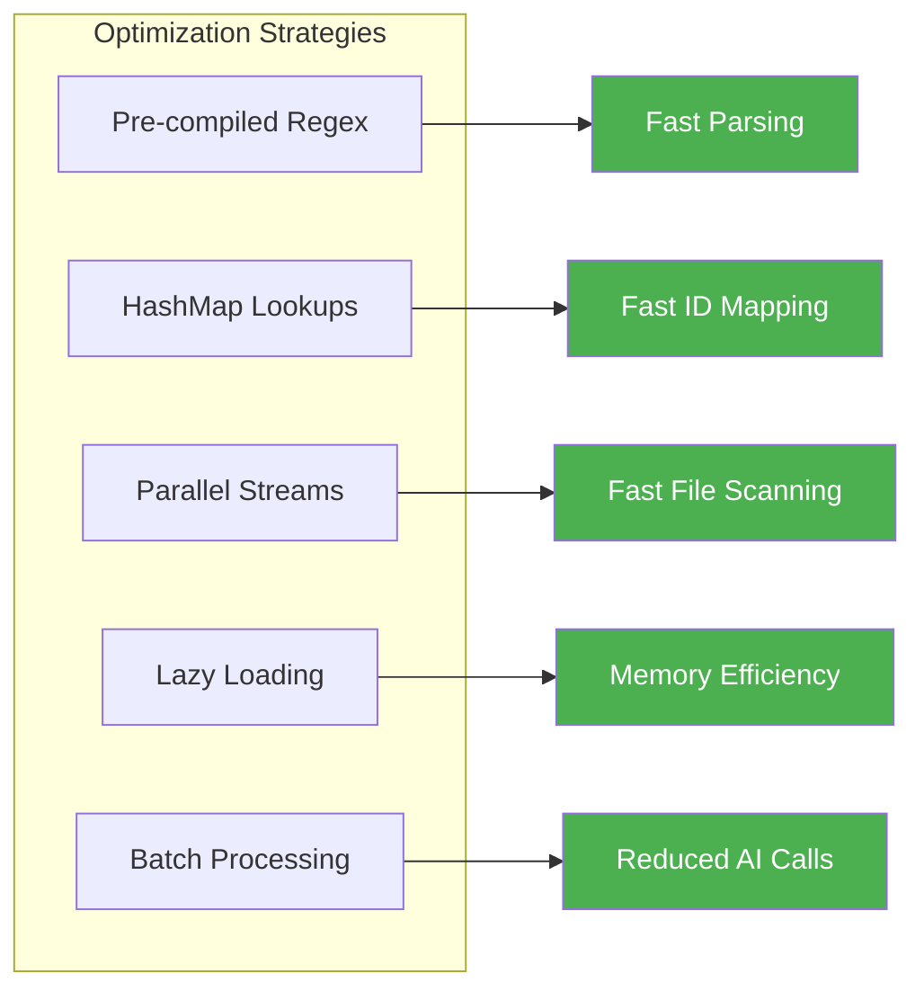

## Extension Points

The architecture supports extension through:

1. **Custom AI Agents**: Implement new analysis or aggregation logic
2. **Additional Entity Types**: Extend beyond Q/A/N
3. **Custom Statistics**: Add new metrics and reports
4. **Integration Hooks**: Connect to external systems
5. **Custom Validators**: Add domain-specific validation rules

## Technology Stack

- **Language**: Java 17+
- **AI Integration**: Dial (Claude), Gemini
- **Dependency Injection**: Dagger 2
- **File Format**: Markdown with YAML frontmatter
- **Serialization**: Gson
- **Testing**: JUnit 5, Mockito

