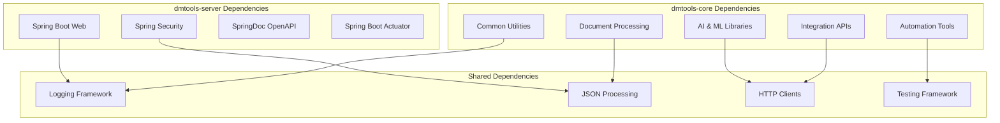
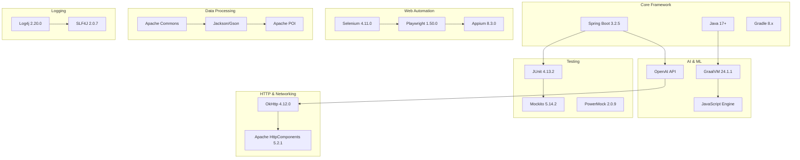
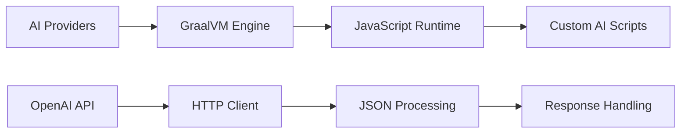
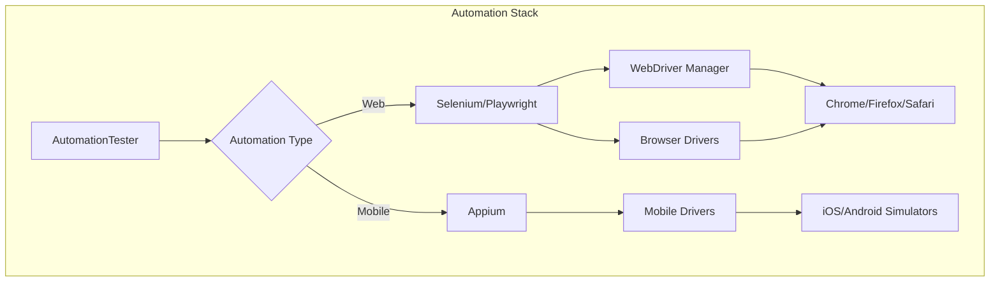
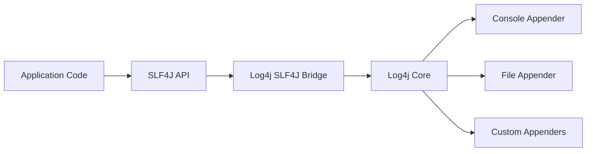
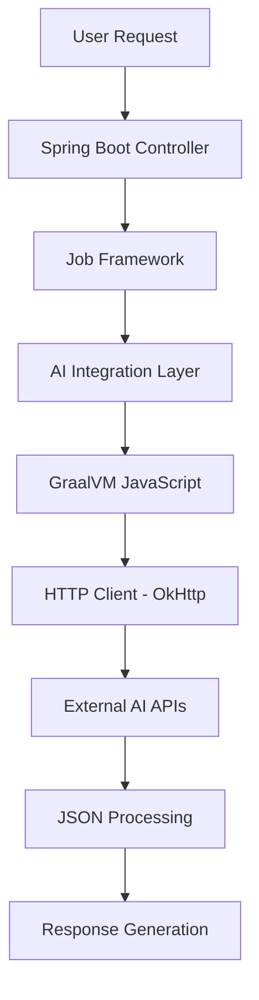
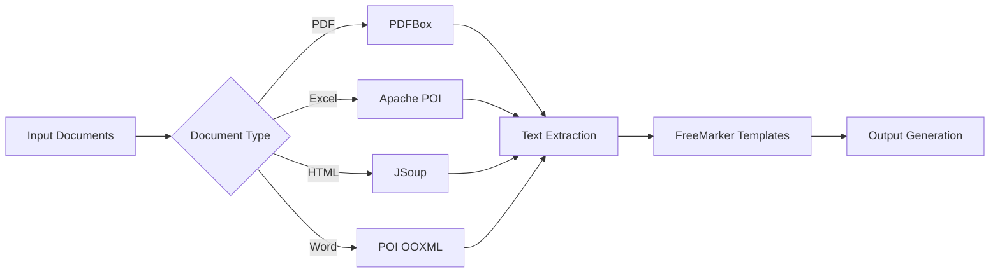
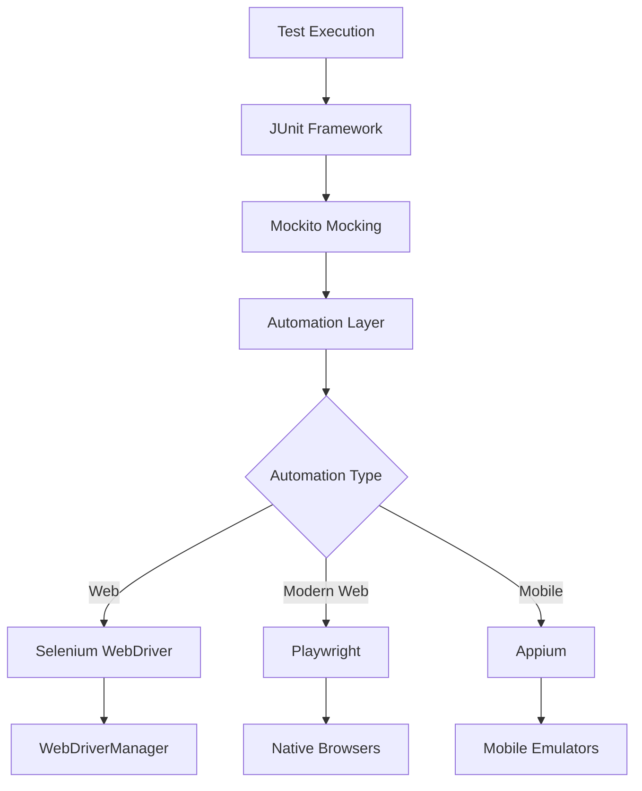

# DMTools - Dependencies Documentation

## Multi-Module Dependency Architecture

DMTools is organized as a **multi-module Gradle project** with dependencies strategically distributed between modules for clean separation of concerns.



### Module Dependency Strategy

| Module | Purpose | Key Dependencies |
|--------|---------|------------------|
| **dmtools-server** | Web services, REST APIs, UI | Spring Boot, Spring Security, OpenAPI |
| **dmtools-core** | Business logic, integrations, AI | AI providers, automation tools, integration APIs |
| **Root project** | Common configuration | Shared utilities, logging, testing framework |

The server module depends on the core module, creating a clean dependency hierarchy where web concerns are separated from business logic.

## Overview

DMTools leverages a comprehensive set of external libraries and frameworks to provide its extensive functionality. This document details all dependencies, their purposes, versions, and relationships within the system.

## Dependency Categories



## Core Dependencies

### 🏗️ Framework & Build Tools

| Dependency | Version | Purpose | Configuration |
|------------|---------|---------|---------------|
| **Spring Boot** | 3.2.5 | Web framework, DI container | `org.springframework.boot:spring-boot-starter-web` |
| **Gradle** | 8.x | Build automation | Gradle Wrapper |
| **Shadow JAR Plugin** | 8.1.1 | Fat JAR creation | `com.github.johnrengelman.shadow` |
| **Dependency Management** | 1.1.4 | Spring dependency management | `io.spring.dependency-management` |

### 🧠 AI & Machine Learning

| Dependency | Version | Purpose | Integration |
|------------|---------|---------|-------------|
| **GraalVM SDK** | 24.1.1 | Polyglot runtime | `org.graalvm.sdk:graal-sdk` |
| **GraalVM JavaScript** | 24.1.1 | JavaScript execution | `org.graalvm.js:js` |
| **JavaScript ScriptEngine** | 24.1.1 | Script engine integration | `org.graalvm.js:js-scriptengine` |



### 🌐 HTTP & Networking

| Dependency | Version | Purpose | Usage |
|------------|---------|---------|-------|
| **OkHttp** | 4.12.0 | HTTP client library | Primary HTTP client for API calls |
| **Apache HttpComponents** | 5.2.1 | Alternative HTTP client | Complex HTTP scenarios |

### 🧪 Testing Framework

| Dependency | Version | Purpose | Scope |
|------------|---------|---------|-------|
| **JUnit** | 4.13.2 | Unit testing framework | `testImplementation` |
| **JUnit Jupiter** | 5.9.1 | Modern JUnit platform | `testImplementation` |
| **Mockito Core** | 5.14.2 | Mocking framework | `testImplementation` |
| **Mockito Inline** | 5.2.0 | Inline mocking | `testImplementation` |
| **PowerMock** | 2.0.9 | Advanced mocking | `testImplementation` |
| **JUnit Vintage** | 5.8.2 | JUnit 4 compatibility | `testRuntimeOnly` |

### 🤖 Automation & Testing

| Dependency | Version | Purpose | Integration |
|------------|---------|---------|-------------|
| **Selenium WebDriver** | 4.11.0 | Web automation | Browser automation |
| **Appium Java Client** | 8.3.0 | Mobile automation | Mobile app testing |
| **Playwright** | 1.50.0 | Modern web automation | Fast web testing |
| **WebDriverManager** | 5.9.2 | Driver management | Automatic driver downloads |



### 📊 Data Processing & Utilities

| Category | Dependency | Version | Purpose |
|----------|------------|---------|---------|
| **JSON** | org.json | 20231013 | JSON processing |
| **JSON** | Gson | 2.10.1 | Google JSON library |
| **Collections** | Apache Commons Collections | 4.3 | Enhanced collections |
| **Language** | Apache Commons Lang | 3.8.1 | String/Object utilities |
| **IO** | Apache Commons IO | 2.14.0 | File operations |
| **Codec** | Apache Commons Codec | 1.15 | Encoding/decoding |
| **Expression** | Apache Commons JEXL | 2.1.1 | Expression language |

### 📄 Document Processing

| Dependency | Version | Purpose | File Types |
|------------|---------|---------|------------|
| **Apache POI** | 4.1.1 | Excel processing | .xlsx, .xls |
| **Apache POI OOXML** | 3.17 | Office document processing | .docx, .pptx |
| **Apache PDFBox** | 3.0.2 | PDF processing | .pdf |
| **JXLS** | 2.14.0 | Excel templates | Template-based Excel |
| **JXLS POI** | 2.14.0 | JXLS POI integration | Excel generation |
| **JXLS Reader** | 2.1.0 | Excel reading | Excel parsing |
| **JSoup** | 1.18.3 | HTML processing | HTML parsing/manipulation |
| **Copy Down** | 1.1 | HTML to Markdown | Document conversion |

### 📝 Templating & Text Processing

| Dependency | Version | Purpose | Usage |
|------------|---------|---------|-------|
| **FreeMarker** | 2.3.30 | Template engine | Report generation |
| **Lorem** | 2.1 | Lorem ipsum generation | Test data generation |

### 🔐 Security & Authentication

| Dependency | Version | Purpose | Integration |
|------------|---------|---------|-------------|
| **Google Auth Library** | 1.19.0 | Google OAuth | Firebase, Google services |
| **Firebase Admin** | 9.1.1 | Firebase integration | Cloud services |

### 📊 Logging & Monitoring

| Dependency | Version | Purpose | Configuration |
|------------|---------|---------|---------------|
| **SLF4J API** | 2.0.7 | Logging facade | Primary logging interface |
| **Log4j API** | 2.20.0 | Logging implementation | Core logging |
| **Log4j Core** | 2.20.0 | Log4j runtime | Logging engine |
| **Log4j SLF4J Impl** | 2.20.0 | SLF4J bridge | Logging integration |



### 🔧 Dependency Injection & Code Generation

| Dependency | Version | Purpose | Usage |
|------------|---------|---------|-------|
| **Dagger** | 2.53.1 | Dependency injection | DI framework |
| **Dagger Compiler** | 2.53.1 | DI code generation | Compile-time DI |
| **Lombok** | 1.18.36 | Code generation | Boilerplate reduction |

### 🖥️ Desktop & UI

| Dependency | Version | Purpose | Usage |
|------------|---------|---------|-------|
| **Tess4J** | 5.8.0 | OCR capabilities | Text recognition |
| **JavaCV** | 1.5.11 | Computer vision | Image processing |

### 📦 Build & Distribution

| Dependency | Version | Purpose | Usage |
|------------|---------|---------|-------|
| **Frontend Maven Plugin** | 1.12.1 | Frontend build | Web UI build |
| **JaCoCo** | - | Code coverage | Test coverage reports |

## Version Resolution Strategy

### Force Version Resolution
The build configuration forces specific versions to avoid conflicts:

```gradle
force "org.seleniumhq.selenium:selenium-java:${versions.selenium}"
force "io.appium:java-client:${versions.appium}"
force "com.google.guava:guava:${versions.guava}"
force "org.slf4j:slf4j-api:${versions.slf4j}"
force "org.apache.logging.log4j:log4j-api:${versions.log4j}"
```

### Dependency Exclusions
Strategic exclusions to prevent conflicts:

```gradle
exclude group: 'com.google.guava'  // For Selenium/Appium
exclude group: 'org.seleniumhq.selenium'  // For Appium
```

## Dependency Relationships

### AI Processing Chain


### Document Processing Pipeline


### Testing & Automation Stack


## Security Considerations

### Dependency Security
- **Regular Updates**: Dependencies are kept up-to-date for security patches
- **Vulnerability Scanning**: Automated dependency vulnerability checking
- **License Compliance**: All dependencies use compatible licenses

### Excluded Dependencies
Some transitive dependencies are excluded to prevent:
- Version conflicts
- Security vulnerabilities
- License incompatibilities
- Bloated JAR sizes

## Performance Impact

### JAR Size Impact
| Category | Estimated Size | Impact |
|----------|---------------|---------|
| Core Framework | ~50MB | Essential |
| AI Libraries | ~20MB | High value |
| Automation Tools | ~30MB | Role-specific |
| Document Processing | ~15MB | Feature-specific |
| Utilities | ~10MB | Minimal |

### Runtime Performance
- **Lazy Loading**: Heavy dependencies loaded on demand
- **Connection Pooling**: HTTP clients use connection pooling
- **Caching**: Frequently used data cached in memory
- **Asynchronous Processing**: Non-blocking operations where possible

## Development Dependencies

### Build-Time Only
- Lombok annotation processor
- Dagger compiler
- Testing frameworks (not in runtime JAR)

### Optional Dependencies
Some dependencies are optional based on usage:
- Selenium (only if web automation used)
- Appium (only if mobile automation used)
- Firebase (only if cloud integration used)

This comprehensive dependency management ensures DMTools provides robust functionality while maintaining reasonable resource usage and security standards. 