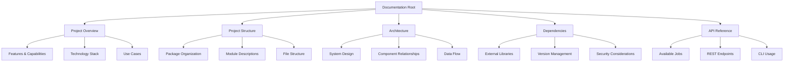

# DMTools Documentation

Welcome to the comprehensive documentation for DMTools (Delivery Management Tools) - a powerful Java-based framework for automating software development lifecycle management.

## 📚 Documentation Overview

This documentation suite provides complete coverage of DMTools, from basic concepts to advanced usage patterns. Whether you're a developer integrating DMTools into your workflow, a system administrator deploying the platform, or a team lead evaluating automation options, you'll find the information you need here.

## 📋 Documentation Structure

## 📖 Documentation Files

### 🎯 [Project Overview](PROJECT_OVERVIEW.md)
**Essential reading for all users**

Get started with DMTools by understanding its purpose, key features, and capabilities. This document covers:
- Introduction to DMTools and its vision
- Key features and role-based functionality
- Technology stack overview
- Use cases and industry applications
- Getting started guide
- Future roadmap

**Best for:** New users, decision makers, project managers

### 🏗️ [Project Structure](PROJECT_STRUCTURE.md)
**For developers and system architects**

Detailed breakdown of how DMTools is organized, including:
- Directory and package structure
- Module descriptions and responsibilities
- Configuration file organization
- Build artifacts and deployment structure
- Extension points for customization
- Development workflow

**Best for:** Developers, architects, contributors

### 🔧 [Architecture](ARCHITECTURE.md)
**Deep dive for technical stakeholders**

Comprehensive system architecture documentation featuring:
- Layered architecture overview
- Core component relationships
- Data flow diagrams
- Integration patterns
- Security architecture
- Deployment configurations
- Scalability considerations

**Best for:** System architects, senior developers, DevOps engineers

### 📦 [Dependencies](DEPENDENCIES.md)
**Critical for deployment and maintenance**

Complete dependency analysis covering:
- All external libraries and versions
- Dependency categories and relationships
- Security and licensing information
- Performance impact analysis
- Version resolution strategies
- Upgrade guidance

**Best for:** DevOps engineers, security teams, maintenance teams

### 🚀 [API Reference](API_REFERENCE.md)
**Complete usage guide for all interfaces**

Comprehensive API documentation including:
- All available jobs and their parameters
- REST API endpoints and examples
- CLI usage patterns
- Parameter validation rules
- Error handling and troubleshooting
- Best practices and optimization tips

**Best for:** Developers, automation engineers, system integrators

## 🎯 Quick Start Guide

### For New Users
1. Start with [Project Overview](PROJECT_OVERVIEW.md) to understand DMTools capabilities
2. Review the [API Reference](API_REFERENCE.md) to see available jobs
3. Check the main [README.md](../README.md) for setup instructions

### For Developers
1. Study the [Project Structure](PROJECT_STRUCTURE.md) to understand the codebase
2. Review the [Architecture](ARCHITECTURE.md) for design patterns
3. Examine [Dependencies](DEPENDENCIES.md) for technical requirements

### For System Administrators
1. Review [Dependencies](DEPENDENCIES.md) for deployment requirements
2. Study [Architecture](ARCHITECTURE.md) for infrastructure needs
3. Reference [API Reference](API_REFERENCE.md) for endpoint configuration

### For Integration Teams
1. Focus on [API Reference](API_REFERENCE.md) for integration patterns
2. Review [Architecture](ARCHITECTURE.md) for system interfaces
3. Check [Dependencies](DEPENDENCIES.md) for compatibility requirements

## 🔍 Finding What You Need

### By Role

| Role | Primary Documents | Focus Areas |
|------|------------------|-------------|
| **Product Manager** | Project Overview, API Reference | Features, capabilities, use cases |
| **Software Architect** | Architecture, Project Structure | System design, patterns, scalability |
| **Developer** | Project Structure, API Reference, Dependencies | Code organization, APIs, libraries |
| **DevOps Engineer** | Dependencies, Architecture | Deployment, infrastructure, monitoring |
| **QA Engineer** | API Reference, Project Overview | Testing capabilities, automation features |
| **Business Analyst** | Project Overview, API Reference | Business features, reporting capabilities |

### By Task

| Task | Recommended Reading Order |
|------|---------------------------|
| **Evaluating DMTools** | Project Overview → API Reference → Architecture |
| **Setting up Development** | Project Structure → Dependencies → API Reference |
| **Deploying DMTools** | Dependencies → Architecture → API Reference |
| **Integrating DMTools** | API Reference → Architecture → Dependencies |
| **Contributing Code** | Project Structure → Architecture → Dependencies |
| **Troubleshooting** | API Reference → Dependencies → Architecture |

## 🔗 External Resources

### Related Documentation
- [Main README](../README.md) - Setup and basic usage
- [API Description](../api_description.md) - Detailed API examples
- [Build Configuration](../build.gradle) - Gradle build setup

### Community Resources
- [GitHub Repository](https://github.com/IstiN/dmtools) - Source code and issues
- [Releases](https://github.com/IstiN/dmtools/releases) - Download latest versions
- [JitPack](https://jitpack.io/#IstiN/dmtools) - Maven/Gradle integration

## 📝 Documentation Standards

### Conventions Used
- **Bold text**: Important concepts, file names, parameters
- *Italic text*: Emphasis, variable names
- `Code blocks`: Commands, code snippets, configuration
- 📁 **Folders**, 📄 **Files**: Directory and file references
- 🔧 **Icons**: Category indicators for quick visual reference

### Mermaid Diagrams
All architecture and flow diagrams use Mermaid syntax for:
- System architecture visualization
- Data flow representation
- Component relationships
- Process workflows

### Code Examples
- All code examples are tested and functional
- Environment variables are clearly indicated
- Common patterns are highlighted
- Error handling is included where relevant

## 🔄 Keeping Documentation Current

This documentation is maintained alongside the codebase to ensure accuracy and relevance. Each major release includes:
- Updated dependency information
- New feature documentation
- Revised architecture diagrams
- Enhanced API examples

### Version Compatibility
- Documentation version corresponds to DMTools releases
- Backward compatibility notes are included for major changes
- Migration guides are provided for breaking changes

## 🤝 Contributing to Documentation

We welcome contributions to improve this documentation:
- Corrections and clarifications
- Additional examples and use cases
- New diagrams and visualizations
- Translation into other languages

See the main repository for contribution guidelines.

---

**This documentation represents a comprehensive guide to DMTools, designed to support users at all levels from initial evaluation through advanced customization and deployment.** 